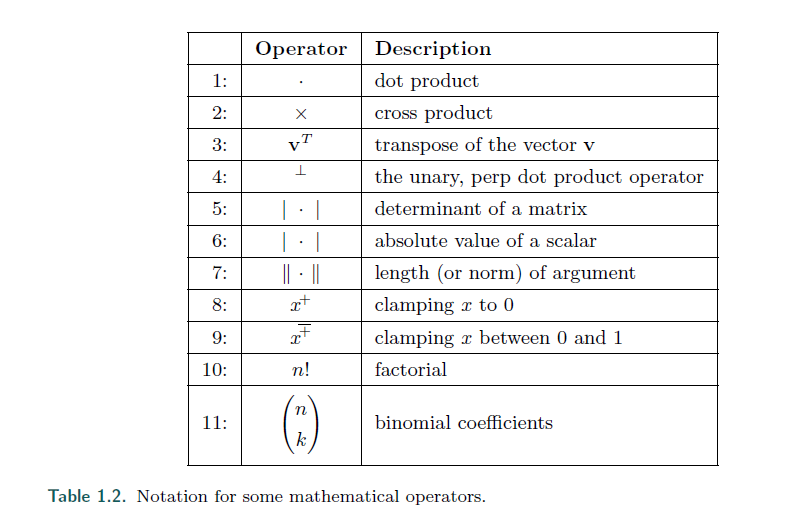
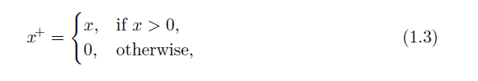
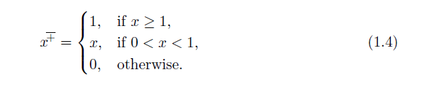
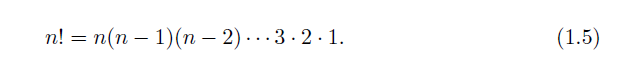
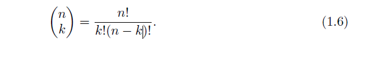
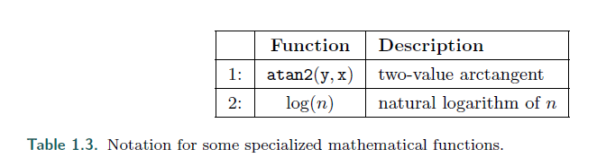

# Chapter1 Introdution

## 1.2 Notation and Definitions
>* First, we shall explain the mathematical notation used in this book. For a more
thorough explanation of many of the terms used in this section, and throughout this
book, get our linear algebra appendix at realtimerendering.com.
---
首先，我们来解释下本书用到的数学符号。
更多的内容可以在 **realtimerendering.com** 的线性代数章节找到。

### 1.2.1 Mathematical Notation

>* summarizes most of the mathematical notation we will use. Some of the
concepts will be described at some length here.
---
表1.1 总结了绝大多数我们用到的数学符号。

这里将描述某些概念


>* Note that there are some exceptions to the rules in the table, primarily shading
equations using notation that is extremely well established in the literature, e.g., L
for radiance, E for irradiance, and σs for scattering coefficient.
---
注意到有些表达式会是例外。

主要会出现在用符号建立的shading方程。

比如用 L 表示辐射，E表示辐射度，σs 表示散射系数。

>* The angles and the scalars are taken from R, i.e., they are real numbers. Vectors
and points are denoted by bold lowercase letters, and the components are accessed as
---
角度和常数的符号取自 R 集合。

向量和点用小写字母表示。

向量用这个方法来表示：


>* that is, in column vector format, which is commonly used in the computer graphics
world. At some places in the text we use (vx, vy, vz) instead of the formally more
correct (vx vy vz)T , since the former is easier to read.
---
这是列向量的格式，在计算机图形学中很常见。

有时会用 (vx, vy, vz) 来代替 (vx vy vz)T， 因为更方便理解。

>* Using homogeneous notation, a coordinate is represented by four values v =
(vx vy vz vw)T , where a vector is v = (vx vy vz 0)T and a point is
v = (vx vy vz 1)T . Sometimes we use only three-element vectors and points, but we
try to avoid any ambiguity as to which type is being used. For matrix manipulations,
it is extremely advantageous to have the same notation for vectors as for points. For
more information, see Chapter 4 on transforms. In some algorithms, it will be convenient
to use numeric indices instead of x, y, and z, for example v = (v0 v1 v2)T . All
these rules for vectors and points also hold for two-element vectors; in that case, we
simply skip the last component of a three-element vector.
---
用齐次符号，一个坐标可以被4个值表示为 v = (vx vy vz vw)T

v = (vx vy vz 0)T 表示一个向量

v = (vx vy vz 1)T 表示一个点

有时我们只会使用3维的向量和点，但我们要去避免他是哪种类型的歧义。

对于矩阵操作，有数学符号去标记是点还是向量是非常有优势的，详细可以看第四章的内容。

在一些算法中， 我们会用一些数字索引去代替 x，y，z，比如 v = (v0 v1 v2)T。

所有这些规则对于 2元的向量同样适用。

在2元的情况下，我们只需要简单的跳过3元向量的最后一个元素即可。

>* The matrix deserves a bit more explanation. The common sizes that will be used
are 2 × 2, 3 × 3, and 4 × 4. We will review the manner of accessing a 3 × 3 matrix
M, and it is simple to extend this process to the other sizes. The (scalar) elements of
M are denoted mij , 0 ≤ (i, j) ≤ 2, where i denotes the row and j the column, as in
Equation 1.1:
---
矩阵的表达如下：


>* The following notation, shown in Equation 1.2 for a 3 × 3 matrix, is used to isolate
vectors from the matrix M: m,j represents the jth column vector and mi, represents
the ith row vector (in column vector form). As with vectors and points, indexing
the column vectors can also be done with x, y, z, and sometimes w, if that is more
convenient:
---
下面的是矩阵的列或行的表达


>* A plane is denoted π : n · x + d = 0 and contains its mathematical formula, the
plane normal n and the scalar d. The normal is a vector describing what direction
the plane faces. More generally (e.g., for curved surfaces), a normal describes this
direction for a particular point on the surface. For a plane the same normal happens
to apply to all its points. π is the common mathematical notation for a plane. The
plane π is said to divide the space into a positive half-space, where n · x + d > 0, and
a negative half-space, where n · x+d < 0. All other points are said to lie in the plane.
---
平面的表示公式为， π : n · x + d = 0 ，其中 n 表示平面法线，还有常量 d。

法线是一个描述平面朝向的向量。

更广泛的说（比如，对于弯曲的表面），法线描述了在表面上确切一个点的朝向。

对于平面而言，适用于所有点。

π 是一个常见的用语描述平面的数学符号。

π 会将空间分为2半，当 n · x + d > 0 时，为正半空间，反之亦然。其他的所有点则在平面上。

>* A triangle can be defined by three points v0, v1, and v2 and is denoted by
△v0v1v2.
---
一个有 v0，v1，v2三个点的三角形被记做 △v0v1v2

>* Table 1.2 presents some additional mathematical operators and their notation.
The dot, cross, determinant, and length operators are explained in our downloadable
linear algebra appendix at realtimerendering.com. The transpose operator turns a
column vector into a row vector and vice versa. Thus a column vector can be written
in compressed form in a block of text as v = (vx vy vz)T . Operator 4, introduced
in Graphics Gems IV [735], is a unary operator on a two-dimensional vector.
---
表1.2 记录了更多的数学运算符和他们的符号。

点乘，叉乘，行列式，求模，都在数学附录里可以找到解释。

转置符号能将一个列向量转换成一个行向量，反之亦然。

因此一个列向量可以写成 v = (vx vy vz)T。

操作4， 是一个对2维向量的 一元操作。



>* Letting this operator work on a vector v = (vx vy)T gives a vector that is perpendicular to v,
i.e., v⊥ = (−vy vx)T . We use |a| to denote the absolute value of the scalar a, while
|A| means the determinant of the matrix A. Sometimes, we also use |A| = |a b c| =
det(a, b, c), where a, b, and c are column vectors of the matrix A.
---
对 v(vx vy)T 进行一次 ⊥ 操作会得到一个与v垂直的向量， 比如： v⊥ = (−vy vx)T。

我们用 |a| 来表示常数 a 的绝对值，用 |A| 来表示矩阵 A 的行列式。

有时我们用 |A| = |a b c| = det(a, b, c)，当a，b，c是矩阵A的列向量时。

>* Operators 8 and 9 are clamping operators, commonly used in shading calculations.
Operator 8 clamps negative values to 0:  and operator 9 clamps values between 0 and 1:
---
操作符 8 和 9 是限制操作符，经常用于 shading 的计算。





>* The tenth operator, factorial, is defined as shown below, and note that 0! = 1:
---
第10个操作符是阶乘，定义 0! = 1



>* The eleventh operator, the binomial factor, is defined as shown in Equation 1.6:
---
第11个操作符是二次项系数，被如此定义



>* Further on, we call the common planes x = 0, y = 0, and z = 0 the coordinate
planes or axis-aligned planes. The axes ex = (1 0 0)T , ey = (0 1 0)T , and
ez = (0 0 1)T are called main axes or main directions and individually called the
x-axis, y-axis, and z-axis. This set of axes is often called the standard basis. Unless
otherwise noted, we will use orthonormal bases (consisting of mutually perpendicular
unit vectors).
---
进一步，我们把常见的平面 x = 0, y = 0, 和 z = 0 成为 坐标平面 或 轴-对齐 平面。

轴 ex = (1 0 0)T , ey = (0 1 0)T , 和 ez = (0 0 1)T 称为主轴或者方向轴，分别是 x，y，z 轴。

这一组轴通常被称为 标准基。

除非是特殊的标记，我们都会使用正交基。（由相互垂直的单位向量构成）

>* The notation for a range that includes both a and b, and all numbers in between,
is [a, b]. If we want all number between a and b, but not a and b themselves, then we
write (a, b). Combinations of these can also be made, e.g., [a, b) means all numbers
between a and b including a but not b.
---
[a, b] 表示包括 a 到 b 的所有实数。

(a, b) 表示不包含 a, b。

>* The C-math function atan2(y,x) is often used in this text, and so deserves some
attention. It is an extension of the mathematical function arctan(x). The main
differences between them are that −π/2 < arctan(x) < π/2 , that 0 ≤ atan2(y, x) < 2π,
and that an extra argument has been added to the latter function. A common use for
arctan is to compute arctan(y/x), but when x = 0, division by zero results. The extra
argument for atan2(y,x) avoids this.
---
C-math 提供的 atan2(y,x) 在本书中经常被使用，故单独拿出来提一提。

它是 arctan(x) 这个函数的拓展。

他们的区别是：
```
 −π/2 < arctan(x) < π/2 
 0 ≤ atan2(y, x) < 2π
```
并且后者还有多需要了一个x参数。

一个常见的用法是求 arctan(y/x) 的值，但当 x = 0 时，就会出错。

atan2(y,x) 则避免了这种情况。

>* 对此，维基百科有很详细的解释 [atan2解释](https://zh.wikipedia.org/wiki/Atan2)
```
对于任意不同时等于0的实参数  x和 y， 
atan2(y,x)所表达的意思是坐标原点为起点，指向(x,y)的射线在坐标平面上
与x轴正方向之间的角的角度。
```
>* 是一个非常方便的计算角度的函数



>* In this volume the notation log(n) always means the natural logarithm, loge(n),
not the base-10 logarithm, log10(n).
---
log(n) 经常表示以自然对数为底，而不是以10为底


>* We use a right-hand coordinate system since this is the standard system for threedimensional
geometry in the field of computer graphics.
---
在这里，我们使用右手系，因为这是标准的3维坐标系。

>* Colors are represented by a three-element vector, such as (red, green, blue), where
each element has the range [0, 1].
---
颜色用三维向量表示，比如  (red, green, blue)，他们的取值范围是 [0, 1]

### 1.2.2 Geometrical Definitions

>* The basic rendering primitives (also called drawing primitives) used by almost all
graphics hardware are points, lines, and triangles.
---
在所有图形硬件上的最基础的渲染单元（也被称为绘制单位），是点，线，还有三角形。

>* Throughout this book, we will refer to a collection of geometric entities as either
a model or an object. A scene is a collection of models comprising everything that
is included in the environment to be rendered. A scene can also include material
descriptions, lighting, and viewing specifications.
---
在本书中，我们将一系列的几何实体的集合，称为模型或者对象。

场景是在一个环境中包含所有要被渲染的模型。

场景可以包括材质，光照，各种视角。

>* Examples of objects are a car, a building, and even a line. In practice, an object
often consists of a set of drawing primitives, but this may not always be the case; an
object may have a higher kind of geometrical representation, such as B´ezier curves or
surfaces, or subdivision surfaces. Also, objects can consist of other objects, e.g., a car
object includes four door objects, four wheel objects, and so on.
---
对象的例子是 一辆车，一个建筑，甚至是一条线。

事实上，一个对象会包含一系列的绘制单元。

例外的是，一个对象可能有着更高一级的集合表现

比如贝塞尔曲线表面，或者是细分表面。

因此，对象会包括其他对象，就像一辆车有4个轮胎一样。

### 1.2.3 Shading

>* Following well-established computer graphics usage, in this book terms derived from
“shading,” “shader,” and related words are used to refer to two distinct but related
concepts: computer-generated visual appearance (e.g., “shading model,” “shading
equation,” “toon shading”) or a programmable component of a rendering system
(e.g., “vertex shader,” “shading language”). In both cases, the intended meaning
should be clear from the context.
---
shading，shader 在本文中会有不同的含义，视上下文而定。

### Further Reading and Resources
>* The most important resource we can refer you to is the website for this book:
realtimerendering.com. It contains links to the latest information and websites relevant
to each chapter. The field of real-time rendering is changing with real-time speed.
In the book we have attempted to focus on concepts that are fundamental and techniques
that are unlikely to go out of style. On the website we have the opportunity
to present information that is relevant to today’s software developer, and we have the
ability to keep it up-to-date.
---
在官网上能获得更多的资源。


