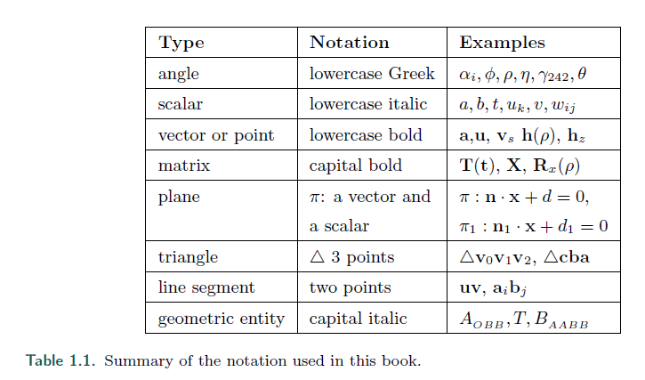
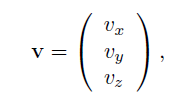
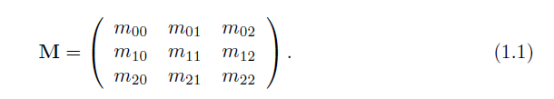
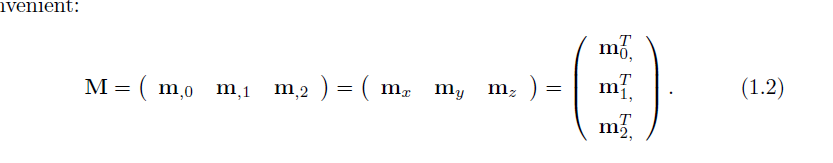

# Chapter1 Introdution

## 1.2 Notation and Definitions
>* First, we shall explain the mathematical notation used in this book. For a more
thorough explanation of many of the terms used in this section, and throughout this
book, get our linear algebra appendix at realtimerendering.com.
---
首先，我们来解释下本书用到的数学符号。
更多的内容可以在 **realtimerendering.com** 的线性代数章节找到。

### 1.2.1 Mathematical Notation

>* summarizes most of the mathematical notation we will use. Some of the
concepts will be described at some length here.
---
表1.1 总结了绝大多数我们用到的数学符号。

这里将描述某些概念

>* Note that there are some exceptions to the rules in the table, primarily shading
equations using notation that is extremely well established in the literature, e.g., L
for radiance, E for irradiance, and σs for scattering coefficient.
---
注意到有些表达式会是例外。

主要会出现在用符号建立的shading方程。

比如用 L 表示辐射，E表示辐射度，σs 表示散射系数。

>* The angles and the scalars are taken from R, i.e., they are real numbers. Vectors
and points are denoted by bold lowercase letters, and the components are accessed as
---
角度和常数的符号取自 R 集合。

向量和点用小写字母表示。

向量用这个方法来表示：

>* that is, in column vector format, which is commonly used in the computer graphics
world. At some places in the text we use (vx, vy, vz) instead of the formally more
correct (vx vy vz)T , since the former is easier to read.
---
这是列向量的格式，在计算机图形学中很常见。

有时会用 (vx, vy, vz) 来代替 (vx vy vz)T， 因为更方便理解。

>* Using homogeneous notation, a coordinate is represented by four values v =
(vx vy vz vw)T , where a vector is v = (vx vy vz 0)T and a point is
v = (vx vy vz 1)T . Sometimes we use only three-element vectors and points, but we
try to avoid any ambiguity as to which type is being used. For matrix manipulations,
it is extremely advantageous to have the same notation for vectors as for points. For
more information, see Chapter 4 on transforms. In some algorithms, it will be convenient
to use numeric indices instead of x, y, and z, for example v = (v0 v1 v2)T . All
these rules for vectors and points also hold for two-element vectors; in that case, we
simply skip the last component of a three-element vector.
---
用齐次符号，一个坐标可以被4个值表示为 v = (vx vy vz vw)T

v = (vx vy vz 0)T 表示一个向量

v = (vx vy vz 1)T 表示一个点

有时我们只会使用3维的向量和点，但我们要去避免他是哪种类型的歧义。

对于矩阵操作，有数学符号去标记是点还是向量是非常有优势的，详细可以看第四章的内容。

在一些算法中， 我们会用一些数字索引去代替 x，y，z，比如 v = (v0 v1 v2)T。

所有这些规则对于 2元的向量同样适用。

在2元的情况下，我们只需要简单的跳过3元向量的最后一个元素即可。

>* The matrix deserves a bit more explanation. The common sizes that will be used
are 2 × 2, 3 × 3, and 4 × 4. We will review the manner of accessing a 3 × 3 matrix
M, and it is simple to extend this process to the other sizes. The (scalar) elements of
M are denoted mij , 0 ≤ (i, j) ≤ 2, where i denotes the row and j the column, as in
Equation 1.1:
---
矩阵的表达如下：

>* The following notation, shown in Equation 1.2 for a 3 × 3 matrix, is used to isolate
vectors from the matrix M: m,j represents the jth column vector and mi, represents
the ith row vector (in column vector form). As with vectors and points, indexing
the column vectors can also be done with x, y, z, and sometimes w, if that is more
convenient:
---
下面的是矩阵的列或行的表达

>* *

