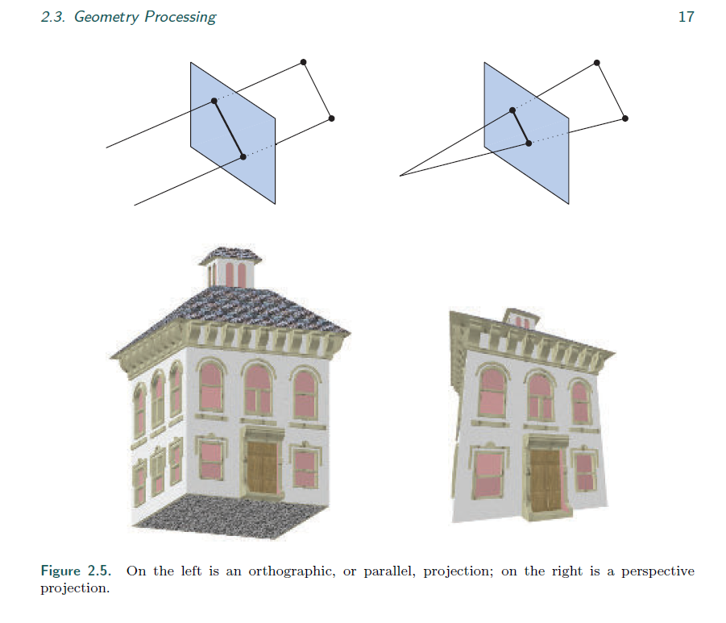

# Chapter2 The Graphics Rendering Pipeline

>* This chapter presents the core component of real-time graphics, namely the graphics
rendering pipeline, also known simply as “the pipeline.” The main function of the
pipeline is to generate, or render, a two-dimensional image, given a virtual camera,
three-dimensional objects, light sources, and more. The rendering pipeline is thus the
underlying tool for real-time rendering. The process of using the pipeline is depicted
in Figure 2.1. The locations and shapes of the objects in the image are determined
by their geometry, the characteristics of the environment, and the placement of the
camera in that environment. The appearance of the objects is affected by material
properties, light sources, textures (images applied to surfaces), and shading equations.
---
这个章节介绍了实时渲染的核心，叫做图形渲染管线，或简称 管线。

渲染管线的主要功能就是在给定 一个虚拟相机，许多3维物体，光源和更多内容的情况下，生成并渲染出一张2维的图片。

因此渲染管线就是实时渲染的核心工具。

图2.1描述了管线的使用流程。

2位图片的位置和形状由他们的几何形状，环境的属性，和摄像机的位置决定。

他们的表现由材质，光照，贴图，以及着色方程决定。


>* We will explain the different stages of the rendering pipeline, with a focus on
function rather than implementation. Relevant details for applying these stages will
be covered in later chapters.
---
我们将着重介绍管线的各个阶段的功能而不是实现。

相关的细节将在更后的章节。

## 2.1 Architecture

>* In the physical world, the pipeline concept manifests itself in many different forms,
from factory assembly lines to fast food kitchens. It also applies to graphics rendering.
A pipeline consists of several stages [715], each of which performs part of a larger task.
---
在现实中，管线有多种不同的表现形式，从工厂流水线到快餐厨房的工作线。

对于图形渲染也一样。

管线由若干阶段组成，每个阶段是一个很大的任务。

>* The pipeline stages execute in parallel, with each stage dependent upon the result
of the previous stage. Ideally, a nonpipelined system that is then divided into n
pipelined stages could give a speedup of a factor of n. This increase in performance
is the main reason to use pipelining. For example, a large number of sandwiches can
be prepared quickly by a series of people—one preparing the bread, another adding
meat, another adding toppings. Each passes the result to the next person in line and
immediately starts work on the next sandwich. If each person takes twenty seconds
to perform their task, a maximum rate of one sandwich every twenty seconds, three
a minute, is possible. The pipeline stages execute in parallel, but they are stalled
until the slowest stage has finished its task. For example, say the meat addition
stage becomes more involved, taking thirty seconds. Now the best rate that can be
achieved is two sandwiches a minute. For this particular pipeline, the meat stage is
the bottleneck, since it determines the speed of the entire production. The toppings
stage is said to be starved (and the customer, too) during the time it waits for the
meat stage to be done.
---
渲染管线的步骤是并行执行的，并且每一个阶段依赖于上一个阶段的结果。

理想情况下，一个非管线的系统分成n个管线阶段能将速度提高到 n 倍。

这种性能的提高是主要选择使用渲染管线的原因。

举个例子，一个巨大的三明治可以被一组人快速的完成，一个准备面包，一个准备肉，一个准备浇头（谷歌翻译~）。

工人会将每个流程的结果传递给下一个工人，并立即开始准备新的三明治的工作。

如果每个工人需要20秒来完成，平均20秒完成一个三明治，一分钟制作3个，是可以达到的。

管线的各个阶段并行执行，然而他们会卡在最慢的阶段。

比如，三明治的添加肉的阶段会很复杂，需要花30秒。

那么现在的速度就变成了 1分钟制作2个三明治。

对于这个三明治管线，肉的制作阶段成了整个管线的瓶颈，因为它决定了整个生产的速度。

添加浇头的阶段，也会被卡住，直到加肉的阶段完成。

>* This kind of pipeline construction is also found in the context of real-time computer
graphics. A coarse division of the real-time rendering pipeline into four main
stages—application, geometry processing, rasterization, and pixel processing—is shown
in Figure 2.2. This structure is the core—the engine of the rendering pipeline—which
is used in real-time computer graphics applications and is thus an essential base for
discussion in subsequent chapters. Each of these stages is usually a pipeline in itself,
which means that it consists of several substages. We differentiate between the functional
stages shown here and the structure of their implementation. A functional stage
has a certain task to perform but does not specify the way that task is executed in the
pipeline. A given implementation may combine two functional stages into one unit
or execute using programmable cores, while it divides another, more time-consuming,
functional stage into several hardware units.
---
这种管道结构也能在实时渲染计算机图形的上下文中被找到。

粗略的分，我们将 rtt 渲染管线分为 4个部分， 应用，几何处理，光栅化，像素处理。如图 2.2

这个结构是渲染管线的核心结构，也是本章讨论的核心内容。

每个阶段自身也是一个管线，意思是它由几个子阶段组成。

我们在这里区分这里显示的 功能性阶段 和 他们的实现结构。

一个 功能性阶段 有一个特定的任务要执行，但不会描述确切在管线中执行的任务。

一个给定的 实现 可能需要将 2个功能性阶段 组合为一个单元 甚至会执行 可编程内核。

当它分为多一个阶段时，会更加耗时，功能性阶段 分为几个硬件 单元。

>* 这段翻译起来奇奇怪怪的，后续再看


```
管线基本分为4个部分，应用，几何处理，光栅化，像素处理。
图中几何处理为例，它其实本身就是一个管线。
而一个阶段可能可以（部分）并行化，就像图中的像素处理过程。
在这个例子中，应用阶段可能是单个进程。
但这个阶段也能被流水线化和并行化。
注：光栅化会找到图元中的基本单位，比如三角形
```

>* The rendering speed may be expressed in frames per second (FPS), that is, the
number of images rendered per second. It can also be represented using Hertz (Hz),
which is simply the notation for 1/seconds, i.e., the frequency of update. It is also
common to just state the time, in milliseconds (ms), that it takes to render an image.
The time to generate an image usually varies, depending on the complexity of the
computations performed during each frame. Frames per second is used to express
either the rate for a particular frame, or the average performance over some duration
of use. Hertz is used for hardware, such as a display, which is set to a fixed rate.
---
渲染速度用FPS表示，表示每秒渲染多少帧。

它也能用Hz表示，这只是 1/秒的单位，即更新的频率。

它也描述了时间，多少毫秒渲染了一张图片。

这个生成一张图片的时间经常变化，取决于每一帧绘制图片的复杂程度。

FPS 用于表示平均性能，而 HZ 一般用于硬件。

>* As the name implies, the application stage is driven by the application and is
therefore typically implemented in software running on general-purpose CPUs. These
CPUs commonly include multiple cores that are capable of processing multiple threads
of execution in parallel. This enables the CPUs to efficiently run the large variety of
tasks that are the responsibility of the application stage. Some of the tasks traditionally
performed on the CPU include collision detection, global acceleration algorithms,
animation, physics simulation, and many others, depending on the type of application.
The next main stage is geometry processing, which deals with transforms, projections,
and all other types of geometry handling. This stage computes what is to be drawn,
how it should be drawn, and where it should be drawn. The geometry stage is typically
performed on a graphics processing unit (GPU) that contains many programmable
cores as well as fixed-operation hardware. The rasterization stage typically takes as
input three vertices, forming a triangle, and finds all pixels that are considered inside
that triangle, then forwards these to the next stage. Finally, the pixel processing stage
executes a program per pixel to determine its color and may perform depth testing
to see whether it is visible or not. It may also perform per-pixel operations such as
blending the newly computed color with a previous color. The rasterization and pixel
processing stages are also processed entirely on the GPU. All these stages and their
internal pipelines will be discussed in the next four sections. More details on how the
GPU processes these stages are given in Chapter 3.
---
顾名思义，应用部分一般在CPU上完成。

这些CPU可能支持多核与并行，支持应用阶段的各种任务。

一些常见的算法，比如碰撞检测，动画，物理模拟等，这些取决于应用阶段的类型。

下一个阶段是几何阶段，它处理了所有的变化，投影，和其他类型的几何处理。

这一部分主要是计算，什么内容需要被绘制，应该怎样绘制（一些法线的处理吧。。），和应该绘制在哪里。

几何阶段在GPU中处理。

光栅化阶段取3个输入的顶点，构成三角形，并寻找应该在三角形内的像素，并传递到下一个阶段。

最后像素处理阶段决定了像素的颜色，以及用深度测试决定它是否可见。

它还可以执行 逐像素操作，比如把当前计算的颜色和原来的颜色做混合。

光栅化和像素处理阶段也是全在 GPU 进行的。

其他的内容会在下面介绍。

## 2.2 The Application Stage

>* The developer has full control over what happens in the application stage, since it
usually executes on the CPU. Therefore, the developer can entirely determine the
implementation and can later modify it in order to improve performance. Changes
here can also affect the performance of subsequent stages. For example, an application
stage algorithm or setting could decrease the number of triangles to be rendered.
---
开发人员对应用阶段有完全的掌控，因为这些都在CPU上处理。

因此，我们可以完全确定它们的实现方式，并后续做改进。

这里也会影响后面的表现。

比如，我们应该尽可能的剪去三角形的数量。

>* All this said, some application work can be performed by the GPU, using a separate
mode called a compute shader. This mode treats the GPU as a highly parallel general
processor, ignoring its special functionality meant specifically for rendering graphics.
---
有一种说法是，有些应用可以由GPU执行，使用单独的 计算着色器。

这种模式，是将GPU视为一个高并发的处理器，而忽略了其渲染图形的功能（人工智能等）。

>* At the end of the application stage, the geometry to be rendered is fed to the
geometry processing stage. These are the rendering primitives, i.e., points, lines, and
triangles, that might eventually end up on the screen (or whatever output device is
being used). This is the most important task of the application stage.
---
在应用阶段的末尾，要被渲染的几何体提供给 几何处理阶段。

他们是渲染的基本单元，比如，点，线，三角形，最终都有可能出现在屏幕上。

这是应用阶段的最重要任务。

>* A consequence of the software-based implementation of this stage is that it is
not divided into substages, as are the geometry processing, rasterization, and pixel
processing stages.1 However, to increase performance, this stage is often executed
in parallel on several processor cores. In CPU design, this is called a superscalar
construction, since it is able to execute several processes at the same time in the same
stage. Section 18.5 presents various methods for using multiple processor cores.
---
如果是软渲实现，这部分就不会分为 几何处理，光栅化，像素，。

但为了提高性能，多个流水线可以并行。

详细参考 18.5

>* One process commonly implemented in this stage is collision detection. After a
collision is detected between two objects, a response may be generated and sent back
to the colliding objects, as well as to a force feedback device. The application stage
is also the place to take care of input from other sources, such as the keyboard, the
mouse, or a head-mounted display. Depending on this input, several different kinds of
actions may be taken. Acceleration algorithms, such as particular culling algorithms
(Chapter 19), are also implemented here, along with whatever else the rest of the
pipeline cannot handle.
---
在这个阶段，通常实现的是 碰撞检测 这个功能。

在检测到2个物体的碰撞后，可以生成响应，并把响应通知物体，以及一些物理控件。

应用阶段同时会处理输入，比如鼠标，键盘，VR。

根据输入，产生效果。

加速算法（详见第19章），也在这里处理。

## 2.3 Geometry Processing

>* The geometry processing stage on the GPU is responsible for most of the per-triangle
and per-vertex operations. This stage is further divided into the following functional
stages: vertex shading, projection, clipping, and screen mapping (Figure 2.3).
---
几何处理阶段，在GPU中主要负责 三角形和顶点 的预处理操作。

可以分为4个部分，顶点着色，投影，裁剪 以及 屏幕映射。


### 2.3.1 Vertex Shading

>* There are two main tasks of vertex shading, namely, to compute the position for a
vertex and to evaluate whatever the programmer may like to have as vertex output
data, such as a normal and texture coordinates. Traditionally much of the shade of
an object was computed by applying lights to each vertex’s location and normal and
storing only the resulting color at the vertex. These colors were then interpolated
across the triangle. For this reason, this programmable vertex processing unit was
named the vertex shader [1049]. With the advent of the modern GPU, along with some
or all of the shading taking place per pixel, this vertex shading stage is more general
and may not evaluate any shading equations at all, depending on the programmer’s
intent. The vertex shader is now a more general unit dedicated to setting up the data
associated with each vertex. As an example, the vertex shader can animate an object
using the methods in Sections 4.4 and 4.5.
---
顶点着色器有 2 个主要的任务， 顾名思义，计算一个顶点的位置

与求出任何在顶点输出阶段我们需要的值，比如 法线 和 纹理坐标。

一般来说，会将通过灯光，点的位置，法线计算出的阴影存在 vertex 的颜色中。

在三角形中，将这些值做插值。

因此，被称为顶点着色器。

对于现代的GPU，渲染是逐像素的，可能顶点着色器已经用不到渲染方程了（这还是取决于写程序的人）。

现在而言，顶点着色器是一个更加通用的单元，专门处理每个顶点及相关的数据。

在4.4和4.5 可以看到通过顶点着色器设置动画。

>* We start by describing how the vertex position is computed, a set of coordinates
that is always required. On its way to the screen, a model is transformed into several
different spaces or coordinate systems. Originally, a model resides in its own model
space, which simply means that it has not been transformed at all. Each model can
be associated with a model transform so that it can be positioned and oriented. It
is possible to have several model transforms associated with a single model. This
allows several copies (called instances) of the same model to have different locations,
orientations, and sizes in the same scene, without requiring replication of the basic
geometry.
---
我们来谈谈顶点位置是如何计算的，首先，需要一组坐标。

在绘制到屏幕上之前，一个模型会被转换到不同的空间和坐标系。

最初，一个模型存储在自己的模型空间中，这说明它还没有经过变换。

每个模型都会做一个 Model 变换，因此它有了位置和朝向。

Model 变换可以有多个。

这允许对于一个模型来说，可以有多份拷贝（称为实例），在一个场景中不同的位置，朝向，大小

而且这不需要去拷贝基础的几何体信息（即点，线，三角形）

>* It is the vertices and the normals of the model that are transformed by the model
transform. The coordinates of an object are called model coordinates, and after the
model transform has been applied to these coordinates, the model is said to be located
in world coordinates or in world space. The world space is unique, and after the models
have been transformed with their respective model transforms, all models exist in this
same space.
---
模型的顶点和法线会经过 Model 变换。

对应的坐标点由 模型坐标 变为 世界坐标。

世界空间是唯一的。

当模型经过各自的 Model 变换后，他们都会出现在世界空间中。

>* As mentioned previously, only the models that the camera (or observer) sees are
rendered. The camera has a location in world space and a direction, which are used to
place and aim the camera. To facilitate projection and clipping, the camera and all the
models are transformed with the view transform. The purpose of the view transform
is to place the camera at the origin and aim it, to make it look in the direction of the
negative z-axis, with the y-axis pointing upward and the x-axis pointing to the right.
We use the −z-axis convention; some texts prefer looking down the +z-axis. The
difference is mostly semantic, as transform between one and the other is simple. The
actual position and direction after the view transform has been applied are dependent
on the underlying application programming interface (API). The space thus delineated
is called camera space, or more commonly, view space or eye space. An example of
the way in which the view transform affects the camera and the models is shown in
Figure 2.4. Both the model transform and the view transform may be implemented as
4×4 matrices, which is the topic of Chapter 4. However, it is important to realize that
the position and normal of a vertex can be computed in whatever way the programmer
prefers.
---
就像之前提到的，只有被摄像机看到的模型才会被渲染。

摄像机在世界空间中有一个位置和方向，方向用来描述摄像机的朝向。

为了方便投影和裁剪，摄像机和所有的模型都做 View 变换。

View 变换的目的是，将摄像机挪到原点，朝向 -z 轴，+y 为 up 向量，+x 为right向量。

我们约定使用 -z 轴。

有些地方会写 +z 轴，不过问题不大，2者之间的转换很简单。

经过 View 变换的确定的位置和方向，依赖于 API。

这个空间被称为摄像机空间，或者，视角空间。

图2.4 阐述了， View 变换是怎么影响摄像机和模型的显示的。

Model 变换 和 View 变换 都是 4x4 的矩阵，在第四章会详细谈到。

但是，请意识到一点，一个顶点的位置和法线，可以按照程序想要的方式，来任意计算。


>* Next, we describe the second type of output from vertex shading. To produce a
realistic scene, it is not sufficient to render the shape and position of objects, but their
appearance must be modeled as well. This description includes each object’s material,
as well as the effect of any light sources shining on the object. Materials and lights can
be modeled in any number of ways, from simple colors to elaborate representations of
physical descriptions.
---
接下来，我们会描述 顶点着色的 第二类输出。

为了产生实际的场景，仅仅是位置和形状是不够的，他们的表面也需要被建模。

这些描述包括了材质，光照的效果。

材质和光照可以用多种方式建模，从简单的颜色，到精心表现形式的物理描述。

>* This operation of determining the effect of a light on a material is known as shading.
It involves computing a shading equation at various points on the object. Typically,
some of these computations are performed during geometry processing on a model’s
vertices, and others may be performed during per-pixel processing. A variety of material
data can be stored at each vertex, such as the point’s location, a normal, a color,
or any other numerical information that is needed to evaluate the shading equation.
Vertex shading results (which can be colors, vectors, texture coordinates, along with
any other kind of shading data) are then sent to the rasterization and pixel processing
stages to be interpolated and used to compute the shading of the surface.
---
决定一种光在一种材质上的效果叫做渲染。

它涉及到了模型到各个点的渲染方程。

通常情况下，一些计算是在几何处理阶段完成的，而另一些在像素处理阶段完成。

每个顶点都能存下一系列的材质数据，就像点的位置，法线，和颜色一样，这些参数可能都会在渲染方程中用到。

顶点作色的结果，会被送去光栅化阶段和像素处理阶段，去做插值和计算表面的内容。

>* Vertex shading in the form of the GPU vertex shader is discussed in more depth
throughout this book and most specifically in Chapters 3 and 5.
---
在第3章和第5章，能看到更具体的顶点着色相关的内容。

>* As part of vertex shading, rendering systems perform projection and then clipping,
which transforms the view volume into a unit cube with its extreme points at
(−1,−1,−1) and (1, 1, 1). Different ranges defining the same volume can and are
used, for example, 0 ≤ z ≤ 1. The unit cube is called the canonical view volume.
Projection is done first, and on the GPU it is done by the vertex shader. There are
two commonly used projection methods, namely orthographic (also called parallel )
and perspective projection. See Figure 2.5. In truth, orthographic is just one type of
parallel projection. Several others find use, particularly in the field of architecture,
such as oblique and axonometric projections. The old arcade game Zaxxon is named
from the latter.
---
作为顶点着色的一部分，渲染系统会做 投影 和 裁剪。

会把view转化为从 (−1,−1,−1) 到 (1, 1, 1) 的单位正方体内。

不同的范围定义了不同的视线体积。

先会做投影，在GPU 上，通过 顶点着色器 完成。

这里是 2 种常见的投影方式，称为正交投影和透视投影。如图 2.5.

其他的几个用途，比如建筑学部分。



>* Note that projection is expressed as a matrix (Section 4.7) and so it may sometimes
be concatenated with the rest of the geometry transform.
---
在4.7中，投影被表示为矩阵，所以它有时可以和剩下的几何变换结合。

>* The view volume of orthographic viewing is normally a rectangular box, and the
orthographic projection transforms this view volume into the unit cube. The main
characteristic of orthographic projection is that parallel lines remain parallel after the
transform. This transformation is a combination of a translation and a scaling.
---
正交投影的视图体积是一个矩形框。

>* The perspective projection is a bit more complex. In this type of projection, the
farther away an object lies from the camera, the smaller it appears after projection.
In addition, parallel lines may converge at the horizon. The perspective transform
thus mimics the way we perceive objects’ size. Geometrically, the view volume, called
a frustum, is a truncated pyramid with rectangular base. The frustum is transformed
into the unit cube as well. Both orthographic and perspective transforms can be
constructed with 4 × 4 matrices (Chapter 4), and after either transform, the models
are said to be in clip coordinates. These are in fact homogeneous coordinates, discussed
in Chapter 4, and so this occurs before division by w. The GPU’s vertex shader must
always output coordinates of this type in order for the next functional stage, clipping,
to work correctly.
---
透视投影会稍微复杂些。

这种投影中，物体离摄像机越远，它表现得越小。

另外，平行线可能会在地平线出汇聚。

透视投影变换，是在模仿我们感知物体的方式。

几何上，视线体积，被称为视椎体，是一个带有矩形底座的截头金字塔。

视椎体也要被转换为单位正方形。

2种变换都需要一个 4x4 的矩阵，经过变换后，模型就变成了裁剪坐标。

这些实际上是其次坐标，在第四章中讨论，会被除以 w。

GPU的顶点着色器必须输出


