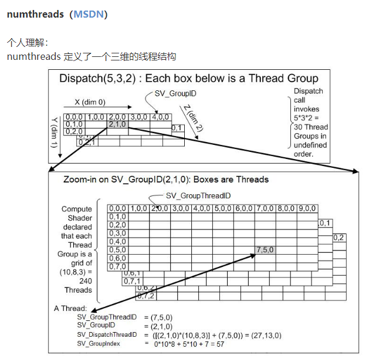
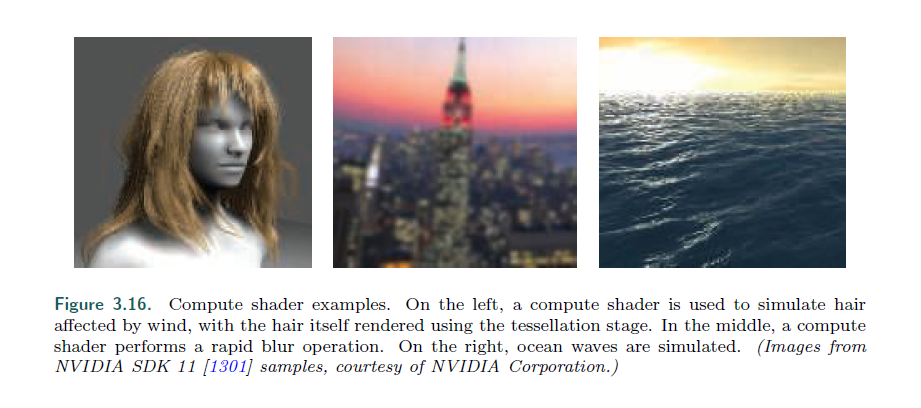

## Chapter 3.10 The Compute Shader

参考

[kh组织的cs解释](https://www.khronos.org/opengl/wiki/Compute_Shader)

[cs的qq简单教程](http://gad.qq.com/article/detail/42202)

[unity的一篇cs教程](http://kylehalladay.com/blog/tutorial/2014/06/27/Compute-Shaders-Are-Nifty.html)

[上文的翻译](http://www.cnblogs.com/Esfog/p/Translation_BeginStart_ComputeShader.html)

>* The GPU can be used for more than implementing the traditional graphics pipeline.
There are many non-graphical uses in fields as varied as computing the estimated
value of stock options and training neural nets for deep learning. Using hardware in
this way is called GPU computing. Platforms such as CUDA and OpenCL are used
to control the GPU as a massive parallel processor, with no real need or access to
graphics-specific functionality. These frameworks often use languages such as C or
C++ with extensions, along with libraries made for the GPU.
---
GPU 不仅仅可以用作实现传统的图形管线。

还有许多非图形的用处，比如估算股票期货的价值，以及训练神经网络。

使用硬件的这一行为，被称为GPU计算。

使用CUDA或者OpenCL等平台，将GPU看成一个大型的并行处理器，没有真正的需求或者去访问特定于图形的功能。

这些框架通常是C或者C++语言写的，以及专门为GPU写的库。

>* Introduced in DirectX 11, the compute shader is a form of GPU computing, in
that it is a shader that is not locked into a location in the graphics pipeline. It is
closely tied to the process of rendering in that it is invoked by the graphics API. It
is used alongside vertex, pixel, and other shaders. It draws upon the same pool of
unified shader processors as those used in the pipeline. It is a shader like the others,
in that it has some set of input data and can access buffers (such as textures) for input
and output. Warps and threads are more visible in a compute shader. For example,
each invocation gets a thread index that it can access. There is also the concept of a
thread group, which consists of 1 to 1024 threads in DirectX 11. These thread groups
are specified by x-, y-, and z-coordinates, mostly for simplicity of use in shader code.
Each thread group has a small amount of memory that is shared among threads. In
DirectX 11, this amounts to 32 kB. Compute shaders are executed by thread group,
so that all threads in the group are guaranteed to run concurrently [1971].
---
在DX11中引入的，cs 是一种GPU计算的形式，它没有确定在图形管线中的哪个位置。

它和渲染过程关联紧密，因为它是由图形API来调用的。

它可以和 vs，ps或者其他shader一起使用。

它使用了相同的 统一着色器处理器 的池子，跟管线中使用的一样。

它是一个跟其他一样的着色器，有一组输入数据，并且能访问缓冲区（比如纹理），然后输入和输出。

组和线程（应该指的GPU的分组机制），在 cs 中更加可视化。

比如，每次调用都能获得一个可访问的线程索引。

这里还有一个概念，是线程组，能够包含 1-1024 个线程（在DX11中）。

这些线程组，由x,y,z 坐标指定，主要是为了简化在 着色器代码中的使用。

每个线程组有一小块内存，能过在组内共享。

DX11中，是 32KB。

cs 由线程组执行，因此所有组内的线程被保证 同时运行。（x,y,z 分线程组，线程组中，也有本地坐标来区分每个线程，线程组中的线程可以相互通信)

(一般来说，cs的每一个线程，处理2D图片的一个像素)。

这是一张网上对cs的线程分布的粗浅理解。

>* One important advantage of compute shaders is that they can access data generated
on the GPU. Sending data from the GPU to the CPU incurs a delay, so
performance can be improved if processing and results can be kept resident on the
GPU [1403]. Post-processing, where a rendered image is modified in some way, is a
common use of compute shaders. The shared memory means that intermediate results
from sampling image pixels can be shared with neighboring threads. Using a
compute shader to determine the distribution or average luminance of an image, for
example, has been found to run twice as fast as performing this operation on a pixel
shader [530].
---
cs的一个很重要的优点就是在于，它能直接获取GPU生成的数据。

将数据从 GPU传到CPU 是需要时间的，因此将处理和结果都驻留在GPU上，能提高GPU的性能。

后处理，将一张渲染图片做某种程度的修改（比如锐化，模糊），是一种 cs 的通常使用的手段。

共享的内存意味着，采样图片像素的中间结果，可以分享给邻近的线程。

我们可以使用 cs 去计算一张图片的分布或者平均亮度，例如，这是在ps上执行这个操作的速度的2倍（ps要跑2次？，一次输出原图，一次做图片计算）

>* Compute shaders are also useful for particle systems, mesh processing such as
facial animation [134], culling [1883, 1884], image filtering [1102, 1710], improving
depth precision [991], shadows [865], depth of field [764], and any other tasks where a
set of GPU processors can be brought to bear. Wihlidal [1884] discusses how compute
shaders can be more efficient than tessellation hull shaders. See Figure 3.16 for other
uses.
---
cs 也同样适用于例子系统，网格处理，面部动画[134]，剔除[1883,1884]，图像过滤[1102,1710]，改进深度精度[991]，阴影[865]，景深[764]，

以及任何用GPU的处理器的并行结构得到收益的内容。

Wihlidal 讨论了如何使用 cs 做到比 ts（曲面细分着色器那一套） 效率更高的曲面细分算法。

3.16 展示了其他的用法。

>* Compute shader examples. On the left, a compute shader is used to simulate hair
affected by wind, with the hair itself rendered using the tessellation stage. In the middle, a compute
shader performs a rapid blur operation. On the right, ocean waves are simulated. (Images from
NVIDIA SDK 11 [1301] samples, courtesy of NVIDIA Corporation.)
---
cs 的例子，左边是模仿野人的毛发，它的头发是曲面细分做的。

中间则是一个快速的模糊手段。

右面，则是模仿海浪。

>* This ends our review of the GPU’s implementation of the rendering pipeline. There
are many ways in which the GPUs functions can be used and combined to perform
various rendering-related processes. Relevant theory and algorithms tuned to take
advantage of these capabilities are the central subjects of this book. Our focus now
moves on to transforms and shading.
---
这里结束了我们对GPU实现管线的回顾。

这里有多种方法使用，以及组合GPU的功能，各种与渲染相关的过程。

相关的理论和算法是这本书的核心内容。

接着我们会谈 变换 和 着色。

## Further Reading and Resources
>* Giesen’s tour of the graphics pipeline [530] discusses many facets of the GPU at
length, explaining why elements work the way they do. The course by Fatahalian and
Bryant [462] discusses GPU parallelism in a series of detailed lecture slide sets. While
focused on GPU computing using CUDA, the introductory part of Kirk and Hwa’s
book [903] discusses the evolution and design philosophy for the GPU.
To learn the formal aspects of shader programming takes some work. Books such
as the OpenGL Superbible [1606] and OpenGL Programming Guide [885] include material
on shader programming. The older book OpenGL Shading Language [1512] does
not cover more recent shader stages, such as the geometry and tessellation shaders,
but does focus specifically on shader-related algorithms.
---
Giesen 的教程讨论了GPU的有时，以及为什么有些工作会这么做。

Fatahalian 和 Bryant 讨论了GPU的并行优势，有一个ppt（好像是某个大学的课程）

而使用CUDA专注于做GPU的计算，在  Kirk and Hwa’s 的书籍中有讨论。

要了解shader编程的更多的相关工作。

类似于 the OpenGL Superbible, OpenGL Programming Guide 的书籍非常推荐。

老的书籍可能没有最新的 shader 步骤，比如 gs 和 ts，但更专注于 shader相关的算法。

