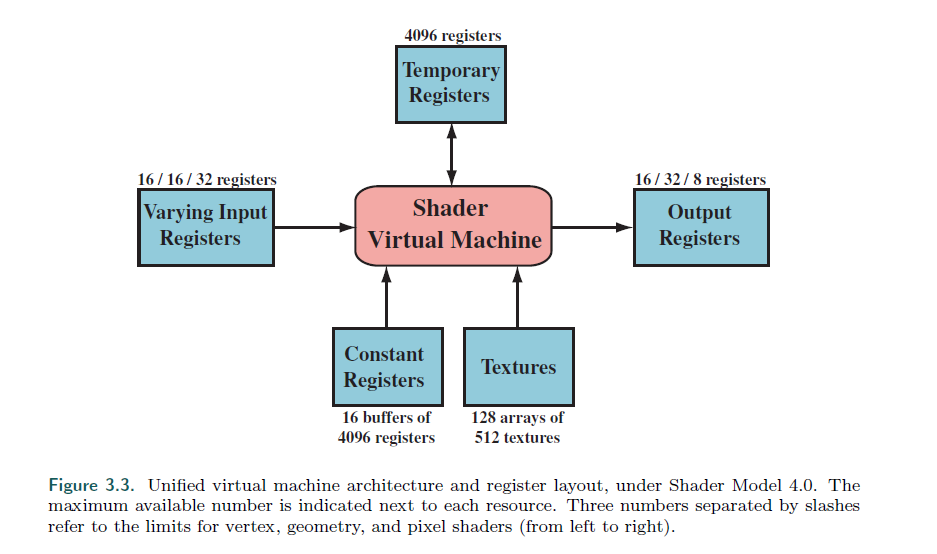
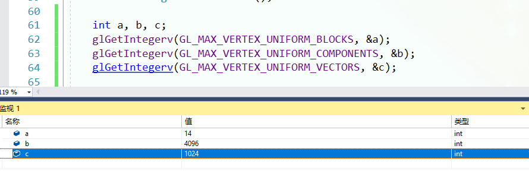

## Chapter 3.3 The Programmable Shader Stage

>* Modern shader programs use a unified shader design. This means that the vertex,
pixel, geometry, and tessellation-related shaders share a common programming model.
Internally they have the same instruction set architecture (ISA). A processor that
implements this model is called a common-shader core in DirectX, and a GPU with
such cores is said to have a unified shader architecture. The idea behind this type of
architecture is that shader processors are usable in a variety of roles, and the GPU
can allocate these as it sees fit. For example, a set of meshes with tiny triangles will
need more vertex shader processing than large squares each made of two triangles. A
GPU with separate pools of vertex and pixel shader cores means that the ideal work
distribution to keep all the cores busy is rigidly predetermined. With unified shader
cores, the GPU can decide how to balance this load.
---
现在的着色器程序使用一种统一的着色器设计。

这意味着，顶点，几何，曲面细分相关的着色器使用同一个编程模型。

在内部，他们使用相同的指令集结构（ISA）。

在DX中，一个实现这种结构的处理器被称为 通用渲染核心。

一个有着这种核心的GPU被称为有 统一渲染结构。

在这种想法后面的是，拥有这种结构的处理可以用于多个不同的功能，并且GPU能够根据需要去分配他们。

比如，一组带有小三角形的网格会需要更多的顶点着色器处理 与 十分大的正方形（只有2个三角形组成）。

具有独立顶点着色核心和像素核心的GPU意味着，理想的工作情况下，所有核心都工作的情况是预先预定的。

使用 统一渲染核心，GPU可以动态的处理它。

>* Describing the entire shader programming model is well beyond the scope of this
book, and there are many documents, books, and websites that already do so. Shaders
are programmed using C-like shading languages such as DirectX’s High-Level Shading
Language (HLSL) and the OpenGL Shading Language (GLSL). DirectX’s HLSL can
be compiled to virtual machine bytecode, also called the intermediate language (IL or
DXIL), to provide hardware independence. An intermediate representation can also
allow shader programs to be compiled and stored offline. This intermediate language
is converted to the ISA of the specific GPU by the driver. Console programming
usually avoids the intermediate language step, since there is then only one ISA for the
system.
---
描述整个渲染程序模型大大的超出了本书的范围，有很多其他的资料。

着色器是被用类似C语言进行编码的，DX是HLSL，OpenGL是GLSL。

DX能够被编译成虚拟机器码，也称为中间语言（IL或DXIL），提供硬件独立性。

一种中间的表示方法同时能够允许着色器程序能够被离线编译和存储。

控制台编程通常会避开中间语言的步骤，因为那是只有一个ISA。

>* The basic data types are 32-bit single-precision floating point scalars and vectors,
though vectors are only part of the shader code and are not supported in hardware as
outlined above. On modern GPUs 32-bit integers and 64-bit floats are also supported
natively. Floating point vectors typically contain data such as positions (xyzw), normals,
matrix rows, colors (rgba), or texture coordinates (uvwq). Integers are most
often used to represent counters, indices, or bitmasks. Aggregate data types such as
structures, arrays, and matrices are also supported.
---
数据的基本类型是32位的单精度浮点数的标量和向量。

虽然向量是着色器代码的唯一一部分不被硬件支持的。（不是很懂这句话）

现在的GPU支持32位的整数64位浮点数。

浮点数向量通常包含位置（xyzw），法线，矩阵行，颜色（rgba），以及纹理坐标（uvwq）。

整数通常用于表示计数器，下标，或者位掩码。

聚合性数据，比如结构体，数组，以及矩阵，都能被支持。

>* A draw call invokes the graphics API to draw a group of primitives, so causing the
graphics pipeline to execute and run its shaders. Each programmable shader stage
has two types of inputs: uniform inputs, with values that remain constant throughout
a draw call (but can be changed between draw calls), and varying inputs, data that
come from the triangle’s vertices or from rasterization. For example, a pixel shader
may provide the color of a light source as a uniform value, and the triangle surface’s
location changes per pixel and so is varying. A texture is a special kind of uniform
input that once was always a color image applied to a surface, but that now can be
thought of as any large array of data.
---
一次dc涉及到了使用显卡的API去画一组基元，因此产生了图形管线的执行，并运行它的着色。

每个可编程的着色阶段有着2种输入：

统一输入，他们的值不会再整个dc的流程中改变（可以在不同的dc中改变）

变化的输入，数据会来自于三角形的顶点或者光栅化。

举个例子，一个像素着色器可能会提供一个光照的颜色作为不变的输入，而三角形表面的每个顶点的位置变化是变化的。

一张纹理是一种特殊的 统一输入，因为它一度会作为图形的表面颜色，但它可以视为一个非常大的数组数据。

>* The underlying virtual machine provides special registers for the different types of
inputs and outputs. The number of available constant registers for uniforms is much
larger than those registers available for varying inputs or outputs. This happens
because the varying inputs and outputs need to be stored separately for each vertex
or pixel, so there is a natural limit as to how many are needed. The uniform inputs are
stored once and reused across all the vertices or pixels in the draw call. The virtual
machine also has general-purpose temporary registers, which are used for scratch space.
All types of registers can be array-indexed using integer values in temporary registers.
The inputs and outputs of the shader virtual machine can be seen in Figure 3.3.
---
底层的虚拟机为不同类型的输入输出提供了特殊的寄存器。

可用的通用寄存器的数量远远比那些为了不同的输入输出设计的特殊寄存器要多。

这么设计的原因是，不同的输入输出需要为每个顶点和像素分别存储，这自然就限制了他们的需要的数量。

统一的输入一旦进行存储，就可以在整个dc的过程中，被所有的顶点和像素重复使用。

虚拟机同样有着通用的临时寄存器，用于作临时空间。

可以使用临时寄存器中的整数型数组对所有种类的寄存器进行索引。

图3.3中可以看到渲染虚拟机的输入和输出。



>* Unified virtual machine architecture and register layout, under Shader Model 4.0. The
maximum available number is indicated next to each resource. Three numbers separated by slashes
refer to the limits for vertex, geometry, and pixel shaders (from left to right).
---
这是Shader Model 4.0一下的虚拟机的同一架构和寄存器布局。

每个资源旁边都会显示最大可用的数量。

3个斜杆表示对顶点，几何，像素着色器的限制。



```
GL_MAX_VERTEX_UNIFORM_COMPONENTS
data returns one value, the maximum number of individual floating-point, integer, or boolean values that can be held in uniform variable storage for a vertex shader. The value must be at least 1024. See glUniform.

GL_MAX_VERTEX_UNIFORM_VECTORS
data returns one value, the maximum number of 4-vectors that may be held in uniform variable storage for the vertex shader. The value of GL_MAX_VERTEX_UNIFORM_VECTORS is equal to the value of GL_MAX_VERTEX_UNIFORM_COMPONENTS and must be at least 256.
```

不知道为什么，block少了两。。。

>* Operations that are common in graphics computations are efficiently executed on
modern GPUs. Shading languages expose the most common of these operations (such
as additions and multiplications) via operators such as * and +. The rest are exposed
through intrinsic functions, e.g., atan(), sqrt(), log(), and many others, optimized
for the GPU. Functions also exist for more complex operations, such as vector normalization
and reflection, the cross product, and matrix transpose and determinant
computations.
---
在现代GPU中，常见的图形计算会十分的高效。

shade语言暴露了大部分的常用数学操作，比如乘法和加法。

其他的是通过已有的函数接口，比如 atan 等数学函数，都被GPU优化过了。

也存在一些比较复杂的操作，比如标准化，叉乘，反射，转置，行列式计算。

>* The term flow control refers to the use of branching instructions to change the
flow of code execution. Instructions related to flow control are used to implement
high-level language constructs such as “if” and “case” statements, as well as various
types of loops. Shaders support two types of flow control. Static flow control branches
are based on the values of uniform inputs. This means that the flow of the code is
constant over the draw call. The primary benefit of static flow control is to allow the
same shader to be used in a variety of different situations (e.g., a varying numbers of
lights). There is no thread divergence, since all invocations take the same code path.
Dynamic flow control is based on the values of varying inputs, meaning that each
fragment can execute the code differently. This is much more powerful than static
flow control but can cost performance, especially if the code flow changes erratically
between shader invocations.
---
术语流控制是指使用分支指令去改变代码的执行流程。

与流控制的指令，在高阶语言的表现是比如 if，case这些语句，或者各种循环。

着色器支持2种不同的流控制。

静态流控制分支，基于统一输入的值。

这意味着，在整个dc中，代码的执行流程是固定的。

静态流控制的主要好处是允许相同的shader使用不同的变量，比如不同数量的灯光。

这里不会有着 线程分歧，意味所有的调用都选择相同的代码路径。

动态流控制是基于不同的输入的，这意味着每个片元可能执行不同的代码。

这能提供跟多的功能，但同时也会是更多的消耗，特别是在控制流在shader的互相调用时不稳定的变化。


