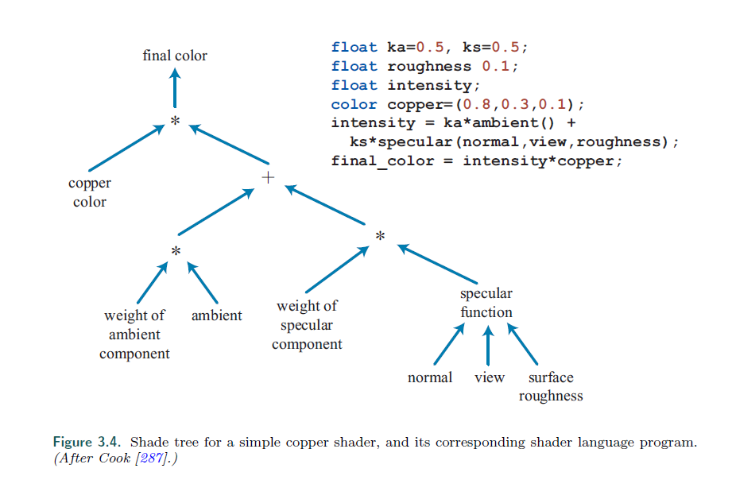
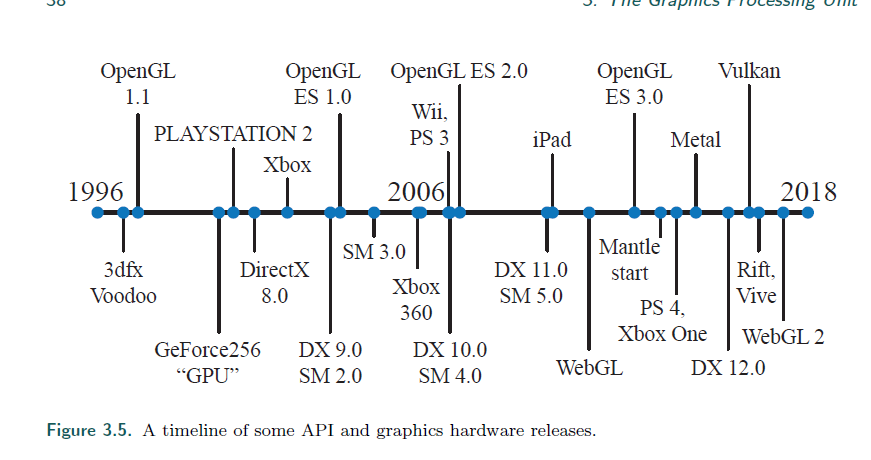
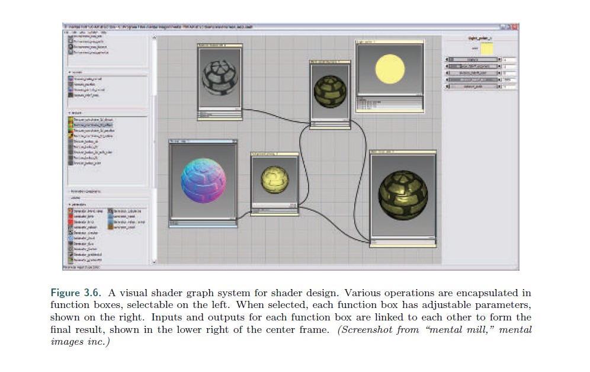

## Chapter 3.4 The Evolution of Programmable Shading and APIs

>* The idea of a framework for programmable shading dates back to 1984 with Cook’s
shade trees [287]. A simple shader and its corresponding shade tree are shown in
Figure 3.4. The RenderMan Shading Language [63, 1804] was developed from this
idea in the late 1980s. It is still used today for film production rendering, along with
other evolving specifications, such as the Open Shading Language (OSL) project [608].
---
可编程的着色框架要追溯到1984年 Cook 的渲染树。

这是一个非常简单的着色过程，它对应的树在图3.4中显示。

1980年，一门叫 RenderMan 的渲染语言从这个想法中诞生出来。

如今，这种渲染模式还在被电影的渲染流程使用，当然，加上了更多的规范，比如 OSL。

简单的cook渲染树。

>* Consumer-level graphics hardware was first successfully introduced by 3dfx Interactive
on October 1, 1996. See Figure 3.5 for a timeline from this year. Their
Voodoo graphics card’s ability to render the game Quake with high quality and performance
led to its quick adoption. This hardware implemented a fixed-function pipeline
throughout. Before GPUs supported programmable shaders natively, there were several
attempts to implement programmable shading operations in real time via multiple
rendering passes. The Quake III: Arena scripting language was the first widespread
commercial success in this area in 1999. As mentioned at the beginning of the chapter,
NVIDIA’s GeForce256 was the first hardware to be called a GPU, but it was not
programmable. However, it was configurable.
---
在1996,10,1，3dfx Interactive成功引入了用户级的图形硬件。

在图3.5中，我们可以看到一个时间的发展线。

他们的Voodoo显卡能够以高品质和高性能去渲染游戏（Quake，雷神之锤）而被迅速采用。

这个硬件从始到终采用了固定功能的渲染管线。

在GPU支持可编程的shader之前，会通过多个渲染过程的组合来实现可编程的着色操作。

The Quake III: Arena（雷神之锤3，竞技场) 的脚本语言本广泛的应用到了商业中，这一年是1999年。

跟开头提到的一样，NVIDIA’s GeForce256 是第一款被称为GPU的硬件，但它不是可编程的。

它是可配置的。

图形API和硬件的时间轴。

>* In early 2001, NVIDIA’s GeForce 3 was the first GPU to support programmable
vertex shaders [1049], exposed through DirectX 8.0 and extensions to OpenGL. These
shaders were programmed in an assembly-like language that was converted by the
drivers into microcode on the fly. Pixel shaders were also included in DirectX 8.0, but
pixel shaders fell short of actual programmability—the limited “programs” supported
were converted into texture blending states by the driver, which in turn wired together
hardware “register combiners.” These “programs” were not only limited in length
(12 instructions or less) but also lacked important functionality. Dependent texture
reads and floating point data were identified by Peercy et al. [1363] as crucial to true
programmability, from their study of RenderMan.
---
在2001年，NVIDIA’s GeForce 3 是第一款支持可编程的顶点着色器的GPU，通过DX8和OpengGL来实现。

这些shader被编程为一段相似的语言，通过硬件编程微码。

DX8同样包含了像素着色器，但是像素着色器达不到真正的可编程，是因为当时的GPU做不到纹理读取。

之后的怪怪的，总之就是因为机器原因，DX8不能有可编程的ps。

>* Shaders at this time did not allow for flow control (branching), so conditionals
had to be emulated by computing both terms and selecting or interpolating between
the results. DirectX defined the concept of a Shader Model (SM) to distinguish hardware
with different shader capabilities. The year 2002 saw the release of DirectX
9.0 including Shader Model 2.0, which featured truly programmable vertex and pixel
shaders. Similar functionality was also exposed under OpenGL using various extensions.
Support for arbitrary dependent texture reads and storage of 16-bit floating
point values was added, finally completing the set of requirements identified by
Peercy et al. Limits on shader resources such as instructions, textures, and registers
were increased, so shaders became capable of more complex effects. Support for
flow control was also added. The growing length and complexity of shaders made
the assembly programming model increasingly cumbersome. Fortunately, DirectX 9.0
also included HLSL. This shading language was developed by Microsoft in collaboration
with NVIDIA. Around the same time, the OpenGL ARB (Architecture Review
Board) released GLSL, a fairly similar language for OpenGL [885]. These languages
were heavily influenced by the syntax and design philosophy of the C programming
language and included elements from the RenderMan Shading Language.
---
这个时候的着色器，并不允许流控制。

所以条件术语必须通过计算2个值，并做插值来解决。

DirectX定义了着色器模型（SM）的概念来区分硬件具有不同的着色器功能。

2002年发布了DirectX9.0包括Shader Model 2.0，它具有真正可编程的顶点和像素着色器。

在OpenGL下使用各种扩展也有了类似的功能。

支持了纹理加载，和16位浮点数的存储，最终完成了 Peercy 的定义。

对着色器资源（如指令，纹理和寄存器）的限定增加了，因此着色器变得能够产生更复杂的效果。

流程控制也被增加了。

着色器的长度和复杂性不断增加，使得渲染模型变得十分繁琐。

幸运的是，DirectX 9.0推出了HLSL。

这种着色语言是由Microsoft与NVIDIA合作开发的。

在同一时间，OpenGL ARB（一个组织）发布了 GLSL，一种和OpenGL相似的语言。

这些语言很大程度上跟C编程的语法和设计理论相似，并且能够包含 RenderMan 这门着色语言的所有元素。

>* Shader Model 3.0 was introduced in 2004 and added dynamic flow control, making
shaders considerably more powerful. It also turned optional features into requirements,
further increased resource limits and added limited support for texture reads in vertex
shaders. When a new generation of game consoles was introduced in late 2005 (Microsoft’s
Xbox 360) and late 2006 (Sony Computer Entertainment’s PLAYSTATION 3
system), they were equipped with Shader Model 3.0–level GPUs. Nintendo’s Wii console
was one of the last notable fixed-function GPUs, which initially shipped in late
2006. The purely fixed-function pipeline is long gone at this point. Shader languages
have evolved to a point where a variety of tools are used to create and manage them.
A screenshot of one such tool, using Cook’s shade tree concept, is shown in Figure 3.6.
---
Shader Model 3.0于2004年推出，并增加了动态流量控制，让shader更加的强大。

它还将一些可选的功能转换为必备功能，进一步增加了资源的限定，并增加了vs读取贴图的限定。

这时，微软在2005年推出了新一代的游戏机 Xbox 360， 索尼在2006推出了 PS3，他们都用的 ShaderModel 3.0 框架的GPU。

任天堂的Wii游戏机是最后一款值得注意的使用固定功能的GPU，它在2006年发售。

在这个时间点以后，纯粹的固定功能管线就再也不存在了。

Shader语言已经发展到，需要使用各种工具来创建和管理他们。

图3.6就是一个类似工具的截图，使用的是Cook 的shade树概念。

>* A visual shader graph system for shader design. Various operations are encapsulated in
function boxes, selectable on the left. When selected, each function box has adjustable parameters,
shown on the right. Inputs and outputs for each function box are linked to each other to form the
final result, shown in the lower right of the center frame. (Screenshot from “mental mill,” mental
images inc.)
---
这是一个可视化的shader编辑工具。

在左侧封装了各种操作功能。

当选中时，每个功能框就有可供调试的参数。

输入和输出会相互连接起来，最后在右下角显示出了最终的颜色。

>* The next large step in programmability also came near the end of 2006. Shader
Model 4.0, included in DirectX 10.0 [175], introduced several major features, such
as the geometry shader and stream output. Shader Model 4.0 included a uniform
programming model for all shaders (vertex, pixel, and geometry), the unified shader
design described earlier. Resource limits were further increased, and support for integer
data types (including bitwise operations) was added. The introduction of GLSL
3.30 in OpenGL 3.3 provided a similar shader model.
---
在2006年底，迎来了下一个可编程化的进步。

SM 4.0， 包括DX 10， 引入了几个新的主要特性，比如几何着色器和流输出。

SM 4.0 包含了一套为所有shader同一的模型，在之前讲过了。

资源的限定进一步增加，并且支持整数数据类型（包含位操作）。

OpenGL 3.3 提供的 GLSL 3.0 同样有相似的 SM。

>* In 2009 DirectX 11 and Shader Model 5.0 were released, adding the tessellation
stage shaders and the compute shader, also called DirectCompute. The release also
focused on supporting CPU multiprocessing more effectively, a topic discussed in Section
18.5. OpenGL added tessellation in version 4.0 and compute shaders in 4.3.
DirectX and OpenGL evolve differently. Both set a certain level of hardware support
needed for a particular version release. Microsoft controls the DirectX API and so
works directly with independent hardware vendors (IHVs) such as AMD, NVIDIA,
and Intel, as well as game developers and computer-aided design software firms, to
determine what features to expose. OpenGL is developed by a consortium of hardware
and software vendors, managed by the nonprofit Khronos Group. Because of the
number of companies involved, the API features often appear in a release of OpenGL
some time after their introduction in DirectX. However, OpenGL allows extensions,
vendor-specific or more general, that allow the latest GPU functions to be used before
official support in a release.
---
2009年，DX11和SM 5.0 发布，增加了曲面细分阶段着色器和计算着色器，被称为 DirectCompute。

这次发布同样支持了CPU的多核处理，在18.5章会谈到，OpenGL在4.0加入了曲面细分阶段，以及在4.3增加了 计算着色器。

DX和OpenGL的进化不同。

两者都对硬件上的支持有了一个明确的版本要求。

微软直接控制DX的API，并和一些独立的硬件供应商，比如AMD，NVIDIA，Intel，还有一些游戏开发者，一起决定提供的新特性。

OpenGL因为由一个非营利组织开发，而且涉及到的公司较多，所以他们的API功能一般会比DX要晚。

然而OpenGL允许拓展，特定于供应商或者更加通用，允许在官方发布版本之前，手动增加最新的GPU功能。

>* The next significant change in APIs was led by AMD’s introduction of the Mantle
API in 2013. Developed in partnership with video game developer DICE, the idea of
Mantle was to strip out much of the graphics driver’s overhead and give this control
directly to the developer. Alongside this refactoring was further support for effective
CPU multiprocessing. This new class of APIs focuses on vastly reducing the time
the CPU spends in the driver, along with more efficient CPU multiprocessor support
(Chapter 18). The ideas pioneered in Mantle were picked up by Microsoft and released
as DirectX 12 in 2015. Note that DirectX 12 is not focused on exposing new GPU
functionality—DirectX 11.3 exposed the same hardware features. Both APIs can be
used to send graphics to virtual reality systems such as the Oculus Rift and HTC
Vive. However, DirectX 12 is a radical redesign of the API, one that better maps to
modern GPU architectures. Low-overhead drivers are useful for applications where
the CPU driver cost is causing a bottleneck, or where using more CPU processors for
graphics could benefit performance [946]. Porting from earlier APIs can be difficult,
and a naive implementation can result in lower performance [249, 699, 1438].
---
下一个API明显的更改是由API在2013年提供的 Mentle API。

这是跟图形游戏开发公司DICE合作完成的，Mentle的主要思想是，剥离大部分的图形硬件的开销，并将这些交由开发者直接控制。

通过这种重构，将更支持与CPU的多处理。

新的API注重于大量的减少CPU的是将消耗，更加高效的利用CPU的多线程支持（18章）。

Mentle的思想被微软吸收，并在2015年推出了 DX12.

注意到，DX12并不专注于新的GPU功能，DX11.3同样暴露了相同的硬件功能。

这2个API都可以将图形开发应用于虚拟现实。

然而，DX12是一个彻底的重新设计，为了更好的对应现在的GPU架构。

低开销的驱动对于应用的CPU驱动是一个瓶颈，或者使用多核处理能得到更好的效果（完全不知道说什么。。。。

使用早期的API以及简单的实现，可能会导致更差的性能表现。

>* Apple released its own low-overhead API called Metal in 2014. Metal was first
available on mobile devices such as the iPhone 5S and iPad Air, with newer Macintoshes
given access a year later through OS X El Capitan. Beyond efficiency, reducing
CPU usage saves power, an important factor on mobile devices. This API has its own
shading language, meant for both graphics and GPU compute programs.
---
苹果在2014年发布了它自己的低消耗API，Metal。

Metal是第一次的应用是在 iphone5S 和 iPad Air上，一年后开发者可用在 OS X El Capitan（OS X操作系统） 获得。

除了效率上的考虑，Metal减少了CPU的用电消耗，这对移动设备来说非常关键。

这个API有它独自的shade语言，使用于图形和GPU计算程序。

>* AMD donated its Mantle work to the Khronos Group, which released its own
new API in early 2016, called Vulkan. As with OpenGL, Vulkan works on multiple
operating systems. Vulkan uses a new high-level intermediate language called SPIRV,
which is used for both shader representation and for general GPU computing.
Precompiled shaders are portable and so can be used on any GPU supporting the
capabilities needed [885]. Vulkan can also be used for non-graphical GPU computation,
as it does not need a display window [946]. One notable difference of Vulkan from
other low-overhead drivers is that it is meant to work with a wide range of systems,
from workstations to mobile devices.
---
AMD 把它的Mantle 代码给了  Khronos 组织，然后 Kh 在2016年发布了新的API，叫做  Vulkan。

相比OpenGL，Vulkan可用在多个操作系统上工作。

Vulkan 使用了一种新的高级中间语言 SPIRV，它用于着色器表示和通用的GPU计算。

预编译的shader是便携式的，所以 Vulkan可用在任何支持 SPIRV 的GPU上使用。

Vulkan 同样可用用作非图形的GPU计算，因此它并不需要一个显示窗口。

Vulkan区别于其他低消耗的驱动的非常重要的一点是，它可以在很多系统上工作，从工作站到移动设备。

>* On mobile devices the norm has been to use OpenGL ES. “ES” stands for Embedded
Systems, as this API was developed with mobile devices in mind. Standard
OpenGL at the time was rather bulky and slow in some of its call structures, as well as
requiring support for rarely used functionality. Released in 2003, OpenGL ES 1.0 was
a stripped-down version of OpenGL 1.3, describing a fixed-function pipeline. While
releases of DirectX are timed with those of graphics hardware that support them,
developing graphics support for mobile devices did not proceed in the same fashion.
For example, the first iPad, released in 2010, implemented OpenGL ES 1.1. In 2007
the OpenGL ES 2.0 specification was released, providing programmable shading. It
was based on OpenGL 2.0, but without the fixed-function component, and so was not
backward-compatible with OpenGL ES 1.1. OpenGL ES 3.0 was released in 2012, providing
functionality such as multiple render targets, texture compression, transform
feedback, instancing, and a much wider range of texture formats and modes, as well
as shader language improvements. OpenGL ES 3.1 adds compute shaders, and 3.2
adds geometry and tessellation shaders, among other features. Chapter 23 discusses
mobile device architectures in more detail.
---
在移动设备上的标准是 OpenGL ES.

ES 代表 内嵌系统 的意思，因为这个API是专门为移动设备设计的。

这个时候的标准OpenGL在某些调用结构上，相对来说比较笨重和慢，同时需要支持很少使用到的函数性(不知道这句话在说什么，应该就是标准OpenGL很笨重，但手机这种设备很少或者根本用不到一些函数功能)

OpenGL ES 1.0 是OpenGL 1.3 的简化版，描述的是固定功能的管线。

而DX这时在支持图形硬件发布，并没有追上对移动设备提供图形支持的潮流。

举个例子，2010年的第一款ipad，就是用 OpenGL ES 1.1 的。

在2007年，发布了OpenGL ES 2.0 规范，并提供了可编程的着色。

它是基于 OpenGL 2.0 的，并没有包含固定功能的组件，所以它不向 ES 1.1 兼容。

2012 年，OpenGL ES 3.0 发布，提供了许多特性，比如多渲染目标，纹理压缩，变化反馈，实例化，以及更加广泛的纹理格式，同时着色器语言也有所提高。

OpenGL ES 3.1 增加了 compute 着色器， 3.2 增加了几何以及曲面细分，以及其他功能。

23 章会对移动设备架构进行更详细的描述。

>* An offshoot of OpenGL ES is the browser-based API WebGL, called through
JavaScript. Released in 2011, the first version of this API is usable on most mobile
devices, as it is equivalent to OpenGL ES 2.0 in functionality. As with OpenGL,
extensions give access to more advanced GPU features. WebGL 2 assumes OpenGL
ES 3.0 support.
---
OpenGL ES 的一个分支就是基于浏览器的API WebGL, 通过 JavaScript 调用。

在2011年，这个API的第一个版本发布，并且能够在大多数移动设备上使用，它大概相当于  OpenGL ES 2.0 的功能。

和OpenGL一样，更高的版本支持更多的GPU特性。

WebGL 2 差不多相当于 OpenGL ES 3.0

>* WebGL is particularly well suited for experimenting with features or use in the
classroom: 1. It is cross-platform, working on all personal computers and almost all mobile
devices. 
2. Driver approval is handled by the browsers. Even if one browser does not support
a particular GPU or extension, often another browser does. 
3. Code is interpreted, not compiled, and only a text editor is needed for development.
4. A debugger is built in to most browsers, and code running at any website can
be examined.
5.Programs can be deployed by uploading them to a website or Github, for
example.
---
webGL 非常适合在课堂上做实验。

1. 它是跨平台的，使用于个人的所有计算机和几乎所有移动设备

2. 驱动程序由浏览器处理。如果一个浏览器不支持，那么另一个应该可以。

3. 代码是解释形的，不是编译形的，只需要文本编辑器就可以开发。

4. 浏览器自带debug功能。

5. 程序可以放在网站上或者GitHub上，很方便。

>* Higher-level scene-graph and effects libraries such as three.js [218] give easy access to
code for a variety of more involved effects such as shadow algorithms, post-processing
effects, physically based shading, and deferred rendering.
---
你可以在 [three.js](https://threejs.org/) 这个网站上找到更高级的应用和算法。

比如阴影，后处理，pbr，后渲染等。

