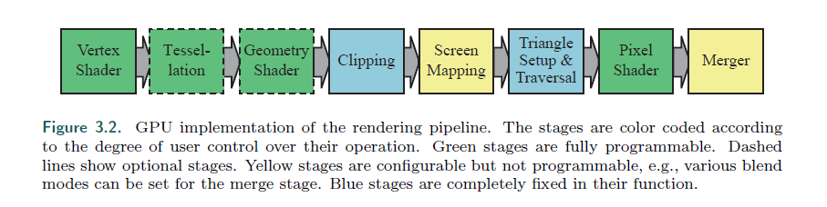
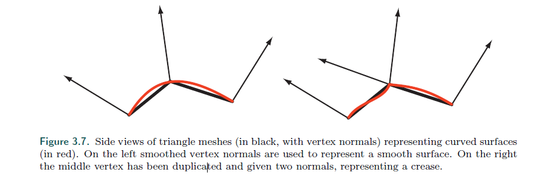
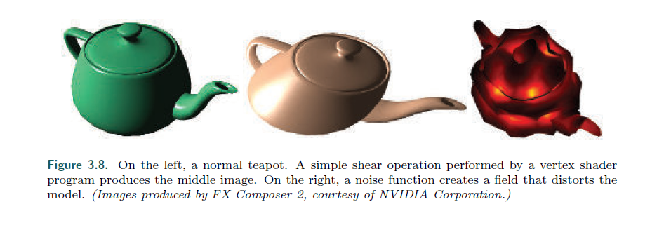

## Chapter 3.5 The Vertex Shader

>* The vertex shader is the first stage in the functional pipeline shown in Figure 3.2.
While this is the first stage directly under programmer control, it is worth noting that
some data manipulation happens before this stage. In what DirectX calls the input
assembler [175, 530, 1208], several streams of data can be woven together to form
the sets of vertices and primitives sent down the pipeline. For example, an object
could be represented by one array of positions and one array of colors. The input
assembler would create this object’s triangles (or lines or points) by creating vertices
with positions and colors. A second object could use the same array of positions
(along with a different model transform matrix) and a different array of colors for its
representation. Data representation is discussed in detail in Section 16.4.5. There is
also support in the input assembler to perform instancing. This allows an object to
be drawn several times with some varying data per instance, all with a single draw
call. The use of instancing is covered in Section 18.4.2.
---
顶点着色器是在图3.2中展示的第一个阶段。

虽然这是第一个直接被程序员控制的阶段，但需要注意到在这个阶段之前，发生了一些数据操作。

这在DX中被称为 输入装配（汇编）， 不同的数据流可以编织在一起，形成传入管线的顶点集和基元。

比如，一个物体可以被一组位置数组加上一组颜色数组来表示。

输入汇编 能够创建这个物体的三角形（或者是点和线），且每个顶点有着对应的位置和颜色。

第二个物体可以使用相同的位置数据（加上一个不同的模型矩阵）与不同的颜色数组来作为它的表现。

数据的表现会在16.4.5中详细讨论。

这里当然还支持用 输入汇编 来表现实例化。

这允许一个物体可以每次使用一些不同的数据来绘制数次，所有的数据都会在一次dc中。

实例化的应用在 18.4.2 中详细介绍。

>* A triangle mesh is represented by a set of vertices, each associated with a specific
position on the model surface. Besides position, there are other optional properties
associated with each vertex, such as a color or texture coordinates. Surface normals are
defined at mesh vertices as well, which may seem like an odd choice. Mathematically,
each triangle has a well-defined surface normal, and it may seem to make more sense
to use the triangle’s normal directly for shading. However, when rendering, triangle
meshes are often used to represent an underlying curved surface, and vertex normals
are used to represent the orientation of this surface, rather than that of the triangle
mesh itself. Section 16.3.4 will discuss methods to compute vertex normals. Figure 3.7
shows side views of two triangle meshes that represent curved surfaces, one smooth
and one with a sharp crease.
---
三角网格的表示是一组顶点的集合，每个顶点对应在模型表面的具体位置。

除了位置，还有有一些可选的属性与顶点相关联，比如颜色和纹理坐标。

但是在渲染中，三角形通常是用来表示在下面的曲线表面，并且顶点的法线通常用来表示这个面的方向，而不是三角形的方向。

16.3.4中，会详细的讨论计算顶点法线的方法。

图3.7表示了2个三角形表示的曲面，一个光滑，一个粗糙（用2条法线表示褶皱）。

>* The vertex shader is the first stage to process the triangle mesh. The data describing
what triangles are formed is unavailable to the vertex shader. As its name implies,
it deals exclusively with the incoming vertices. The vertex shader provides a way
to modify, create, or ignore values associated with each triangle’s vertex, such as its
color, normal, texture coordinates, and position. Normally the vertex shader program
transforms vertices from model space to homogeneous clip space (Section 4.7). At a
minimum, a vertex shader must always output this location.
---
顶点着色器是第一个处理三角形网格的阶段。

描述三角形是怎么组成的数据对于顶点着色器是不可获得的（即获得不到其他的点）。

正如它的名字一样，它仅仅处理传入的顶点。

顶点着色器提供了修改，创造，或者忽略与三角形顶点相关的值的方法，比如颜色，法线，纹理坐标，位置。

通常情况下，顶点着色器会将顶点从模型空间转化到裁剪空间（4.7）。

至少，顶点着色器必须输出当前的位置。

>* A vertex shader is much the same as the unified shader described earlier. Every
vertex passed in is processed by the vertex shader program, which then outputs a
number of values that are interpolated across a triangle or line. The vertex shader
can neither create nor destroy vertices, and results generated by one vertex cannot be
passed on to another vertex. Since each vertex is treated independently, any number
of shader processors on the GPU can be applied in parallel to the incoming stream of
vertices.
---
顶点着色器和前面描述的统一着色器非常相似。

顶点着色器会处理每一个传入的顶点，并输出一组根据三角形或者线段内插值得来的数据。

顶点着色器不能创建，也不能销毁顶点，并且只能生产一个顶点的结果，不能传递给下一个顶点。

正是因为每个顶点都是独立处理的，所以任何数量的GPU着色器处理器都能够并行的处理顶点数据流。

>* Input assembly is usually presented as a process that happens before the vertex
shader is executed. This is an example where the physical model often differs from
the logical. Physically, the fetching of data to create a vertex might happen in the
vertex shader and the driver will quietly prepend every shader with the appropriate
instructions, invisible to the programmer.
---
输入内嵌 经常作为一个在顶点着色器之前的处理。

一个很明显的例子是，物理模型经常和逻辑上的显示不一样。

从物理上讲，获取数据并创建一个顶点，可能会发生在顶点着色器上，但会秘密的为每个shader转变获取的指令，程序员是不可见的。

>* Chapters that follow explain several vertex shader effects, such as vertex blending
for animating joints, and silhouette rendering. Other uses for the vertex shader
include: 1. Object generation, by creating a mesh only once and having it be deformed by
the vertex shader.
2. Animating character’s bodies and faces using skinning and morphing techniques.
3. Procedural deformations, such as the movement of flags, cloth, or water
4. Particle creation, by sending degenerate (no area) meshes down the pipeline and
having these be given an area as needed.
5. Lens distortion, heat haze, water ripples, page curls, and other effects, by using
the entire framebuffer’s contents as a texture on a screen-aligned mesh undergoing
procedural deformation.
6. Applying terrain height fields by using vertex texture fetch
Some deformations done using a vertex shader are shown in Figure 3.8.
---
下面的章节包括了顶点着色的用途。

比如顶点混合动画关节，轮廓渲染，其他的顶点作色器的用途包括：

1. 对象生成，通过只创建一个网格并让它形变的顶点着色器来实现。

2. 使用蒙皮和形变技术，为角色制作身体和面部的动画。

3. 利用程序来实现形变，比如旗帜，布料，水的效果。

4. 粒子生成，通过向管线发送退化（无区域）的网格，给这些粒子需要的区域。

5. 实现 镜头变形，热的雾气，水波纹，页面卷曲以及其他的效果，通过，将整个帧缓冲作为一张纹理，作一次程序上的形变。

6. 使用顶点纹理获取，应用在地形高度地图上。

在3.8中展示了用 vs 做出的一些形变效果。

左边是一个最普通的茶壶。中间做了一次简单的拉伸。右边则是通过噪声函数来形变模型。

>* The output of the vertex shader can be consumed in several different ways. The
usual path is for each instance’s primitives, e.g., triangles, to then be generated and
rasterized, and the individual pixel fragments produced to be sent to the pixel shader
program for continued processing. On some GPUs the data can also be sent to the
tessellation stage or the geometry shader or be stored in memory. These optional
stages are discussed in the following sections.
---
顶点着色器的输出可以用很多种不同的方式使用。

最常见的方式就是为每个实例的基元（比如三角形），生成并进行光栅化，最后为像素着色器提供各个像素的片元。

在一些GPU上，还会被送到曲面细分阶段或者几何着色器，甚至存储在内容中。

下一章会讨论这些内容。

