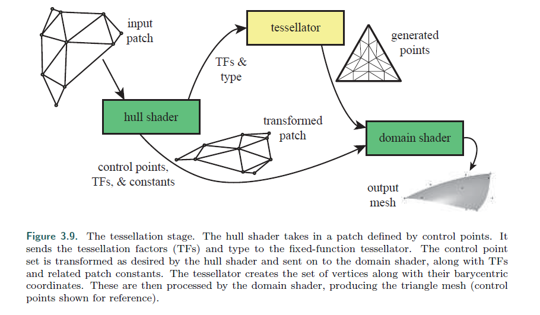
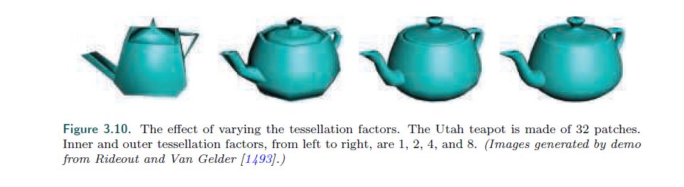
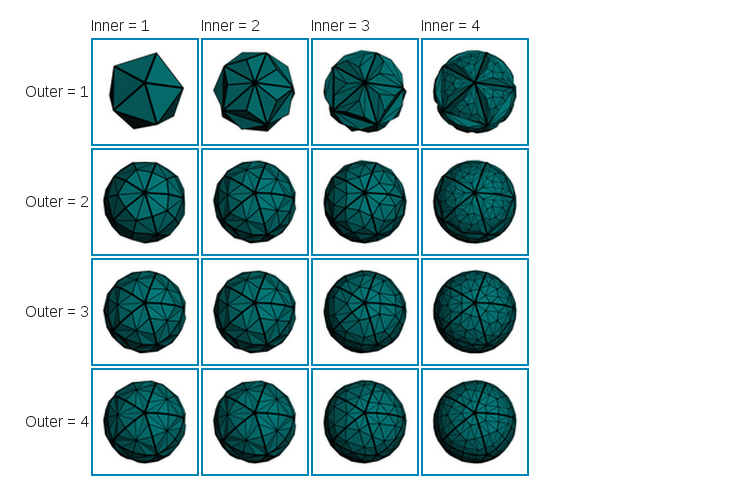

## Chapter 3.6 The tessellation stage

参考 

[曲面细分中文教程](http://wiki.jikexueyuan.com/project/modern-opengl-tutorial/tutorial30.html)
[曲面细分中文教程2](https://www.cnblogs.com/zenny-chen/p/4280100.html)
[khronos-wiki](https://www.khronos.org/opengl/wiki/Tessellation)

>* The tessellation stage allows us to render curved surfaces. The GPU’s task is to take
each surface description and turn it into a representative set of triangles. This stage
is an optional GPU feature that first became available in (and is required by) DirectX
11. It is also supported in OpenGL 4.0 and OpenGL ES 3.2.
---
曲面细分阶段允许我们去渲染曲面。

GPU的任务就是获取每个曲面的描述，并把它转换为一组表现良好的三角形。

这是GPU的一个可选特性，最早在DX11被支持。

OpenGL 4.0 和 OpenGL ES 3.2  同样支持。

>* There are several advantages to using the tessellation stage. The curved surface description
is often more compact than providing the corresponding triangles themselves.
Beyond memory savings, this feature can keep the bus between CPU and GPU from
becoming the bottleneck for an animated character or object whose shape is changing
each frame. The surfaces can be rendered efficiently by having an appropriate number
of triangles generated for the given view. For example, if a ball is far from the camera,
only a few triangles are needed. Up close, it may look best represented with thousands
of triangles. This ability to control the level of detail can also allow an application to
control its performance, e.g., using a lower-quality mesh on weaker GPUs in order to
maintain frame rate. Models normally represented by flat surfaces can be converted to
fine meshes of triangles and then warped as desired [1493], or they can be tessellated
in order to perform expensive shading computations less frequently [225].
---
使用曲面细分有几个优点。

曲面的描述，通常比他们本身对应的三角形更加紧凑。

除了减少内存，这个特点还能避免从CPU到GPU的动画人物或者物体数据传输每一帧变化的动画数据的过程，变为瓶颈。

表面能够快速的渲染，通过由给出的视图生成的恰当数量的三角形。

比如，如果一个球远离摄像机，则只需要少量的三角形。

这种控制LOD的技术也可以允许应用去控制它的性能，比如在弱的GPU上使用低质量的网格，来补偿帧率。

由平面表示的模型，能够被转换为恰当的三角形网格，并需要形变。

或者他们能够被曲面细分，为了不那么频繁的进行代价高的渲染计算。

>* The tessellation stage always consists of three elements. Using DirectX’s terminology,
these are the hull shader, tessellator, and domain shader. In OpenGL the hull
shader is the tessellation control shader and the domain shader the tessellation evaluation
shader, which are a bit more descriptive, though verbose. The fixed-function
tessellator is called the primitive generator in OpenGL, and as will be seen, that is
indeed what it does.
---
曲面细分阶段通常由3个元素组成。

用DX的术语，他们是 壳着色器, 曲面细分器，和域着色器。

在OpenGL中，壳着色器是曲面细分，而域。。。。（不太清楚是怎么回事，总之就是功能互换了一下，感觉应该会在下个版本统一。

固定功能的曲面细分着色器在OpenGL就是 基元生产器，就是生成基元的流程。（就是，最简单的曲面细分，就是不变，基元照旧)

>* How to specify and tessellate curves and surfaces is discussed at length in Chapter
17. Here we give a brief summary of each tessellation stage’s purpose. To begin,
the input to the hull shader is a special patch primitive. This consists of several control
points defining a subdivision surface, B´ezier patch, or other type of curved element.
The hull shader has two functions. First, it tells the tessellator how many triangles
should be generated, and in what configuration. Second, it performs processing on
each of the control points. Also, optionally, the hull shader can modify the incoming
patch description, adding or removing control points as desired. The hull shader outputs
its set of control points, along with the tessellation control data, to the domain
shader. See Figure 3.9.
---
如何识别特定的曲面并细分为恰当的曲面会在17章详细了解。

在这里我们简单的说一下每一个阶段的功能。

首先，输入 hull shader 的是 一个确定的一小块基元 （啥玩意？）

这包括了几个控制点来定义 一小块的曲面，贝塞尔参数，或者是其他类型的曲面元素。（可能这些参数在顶点数据中？）

hull shader 主要有2个功能。

第一，它告诉 细分器 要生成多少个三角形，以及以怎样的配置生成。

第二，它对每个控制点做了处理。

当然，hull shader能够修改输入的 patch 描述，在必要时增加或者删除控制点。

hull shader的输出是它的控制点几何，以及 细分器的 控制数据，给 domain shader. 如图 3.9

>* The tessellation stage. The hull shader takes in a patch defined by control points. It
sends the tessellation factors (TFs) and type to the fixed-function tessellator. The control point
set is transformed as desired by the hull shader and sent on to the domain shader, along with TFs
and related patch constants. The tessellator creates the set of vertices along with their barycentric
coordinates. These are then processed by the domain shader, producing the triangle mesh (control
points shown for reference).
---
曲面细分阶段。 hull shader 接受 被控制点定义的 path.

它将 曲面细分因子(TFs)以及类型，传递给 固定功能 的 细分器。

控制点因为需要，hull shader做了形变，并传递给 domain shader，当然还有 TFs 以及相关的 patch 常数。

细分器会创建一组顶点，以及他们的质心坐标系。

然后再 domian shader 中处理，生成三角形网格（控制显示的点)。

>* The tessellator is a fixed-function stage in the pipeline, only used with tessellation
shaders. It has the task of adding several new vertices for the domain shader to process.
The hull shader sends the tessellator information about what type of tessellation
surface is desired: triangle, quadrilateral, or isoline. Isolines are sets of line strips,
sometimes used for hair rendering [1954]. The other important values sent by the hull
shader are the tessellation factors (tessellation levels in OpenGL). These are of two
types: inner and outer edge. The two inner factors determine how much tessellation
occurs inside the triangle or quadrilateral. The outer factors determine how much
each exterior edge is split (Section 17.6). An example of increasing tessellation factors
is shown in Figure 3.10. By allowing separate controls, we can have adjacent curved
surfaces’ edges match in tessellation, regardless of how the interiors are tessellated.
Matching edges avoids cracks or other shading artifacts where patches meet. The vertices
are assigned barycentric coordinates (Section 22.8), which are values that specify
a relative location for each point on the desired surface.
---
细分器是在管线中的 固定功能阶段，仅仅用于 曲面细分着色器。

它的任务是 为 domain shader 增加几个新的顶点。

hull shader 会将曲面细分的信息来决定需要什么类型的细分器，三角形，四边形，或者 等值线。

等值线，是一组线段的集合，有时会用于头发的渲染。

其他的重要信息（由 hull shader传来的）就是 曲面细分因子（在OpenGL中称为 曲面细分等级).

这里有2种类型，内边和外边。（从内边和外边这里，就看不懂了。）

2个内边因子决定了 曲面细分器在三角形或者四边形的内部，生成多少个新的曲面（进行多少次曲面细分？）

外因子决定了，每个外部边缘 是 怎样 分裂的 (17.6) (一头包。。。)

图3.10就是一个 增加 曲面细分 因子的例子。

通过单独的控制，无论内部是如何细分的，我们可以控制曲面的边界。。。（不知道了。。。讲的是个啥

新加的点是重心的位置。

>* The effect of varying the tessellation factors. The Utah teapot is made of 32 patches.
Inner and outer tessellation factors, from left to right, are 1, 2, 4, and 8. (Images generated by demo
from Rideout and Van Gelder [1493].)
---
不同的曲面细分参数的效果。

这个茶壶由 32 个patch组成。

内外因子，从左到右是  1,2,4,8

这是 inner outer 的例子

>* Chapters that follow explain several vertex shader effects, such as vertex blending
for animating joints, and silhouette rendering. Other uses for the vertex shader
include: 1. Object generation, by creating a mesh only once and having it be deformed by
the vertex shader.
2. Animating character’s bodies and faces using skinning and morphing techniques.
3. Procedural deformations, such as the movement of flags, cloth, or water
4. Particle creation, by sending degenerate (no area) meshes down the pipeline and
having these be given an area as needed.
5. Lens distortion, heat haze, water ripples, page curls, and other effects, by using
the entire framebuffer’s contents as a texture on a screen-aligned mesh undergoing
procedural deformation.
6. Applying terrain height fields by using vertex texture fetch
Some deformations done using a vertex shader are shown in Figure 3.8.
---
下面的章节包括了顶点着色的用途。

比如顶点混合动画关节，轮廓渲染，其他的顶点作色器的用途包括：

1. 对象生成，通过只创建一个网格并让它形变的顶点着色器来实现。

2. 使用蒙皮和形变技术，为角色制作身体和面部的动画。

3. 利用程序来实现形变，比如旗帜，布料，水的效果。

4. 粒子生成，通过向管线发送退化（无区域）的网格，给这些粒子需要的区域。

5. 实现 镜头变形，热的雾气，水波纹，页面卷曲以及其他的效果，通过，将整个帧缓冲作为一张纹理，作一次程序上的形变。

6. 使用顶点纹理获取，应用在地形高度地图上。

在3.8中展示了用 vs 做出的一些形变效果。

左边是一个最普通的茶壶。中间做了一次简单的拉伸。右边则是通过噪声函数来形变模型。

>* The output of the vertex shader can be consumed in several different ways. The
usual path is for each instance’s primitives, e.g., triangles, to then be generated and
rasterized, and the individual pixel fragments produced to be sent to the pixel shader
program for continued processing. On some GPUs the data can also be sent to the
tessellation stage or the geometry shader or be stored in memory. These optional
stages are discussed in the following sections.
---
顶点着色器的输出可以用很多种不同的方式使用。

最常见的方式就是为每个实例的基元（比如三角形），生成并进行光栅化，最后为像素着色器提供各个像素的片元。

在一些GPU上，还会被送到曲面细分阶段或者几何着色器，甚至存储在内容中。

下一章会讨论这些内容。

