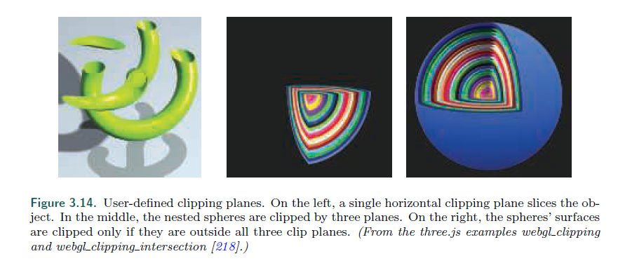
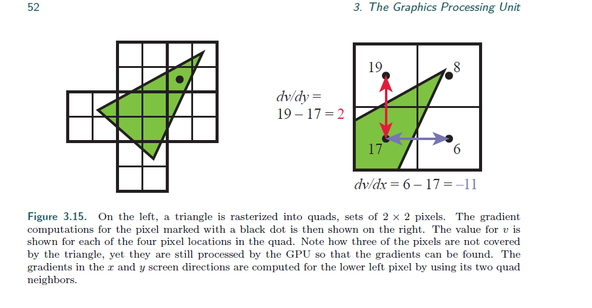

## Chapter 3.8 The Pixel Shader

参考

[后渲染](https://learnopengl-cn.github.io/05%20Advanced%20Lighting/08%20Deferred%20Shading/)

[StackOverFlow ddx 疑问](https://stackoverflow.com/questions/16365385/explanation-of-dfdx)

>* After the vertex, tessellation, and geometry shaders perform their operations, the
primitive is clipped and set up for rasterization, as explained in the previous chapter.
This section of the pipeline is relatively fixed in its processing steps, i.e., not programmable
but somewhat configurable. Each triangle is traversed to determine which
pixels it covers. The rasterizer may also roughly calculate how much the triangle
covers each pixel’s cell area (Section 5.4.2). This piece of a triangle partially or fully
overlapping the pixel is called a fragment.
---
在 vs 曲面细分 gs 之后，基元会被裁剪并被光栅化。

这一部分的管道是相对固定的，不可编程但是可以设置。

遍历每个三角形来确定它覆盖了那些像素。

光栅器也粗略的计算了每个像素的范围内，有多少个三角形覆盖了（5.4.2）。

三角形部分或者全部覆盖一个像素的一部分（piece），称之为片元。

>* The values at the triangle’s vertices, including the z-value used in the z-buffer, are
interpolated across the triangle’s surface for each pixel. These values are passed to
the pixel shader, which then processes the fragment. In OpenGL the pixel shader is
known as the fragment shader, which is perhaps a better name. We use “pixel shader”
throughout this book for consistency. Point and line primitives sent down the pipeline
also create fragments for the pixels covered.
---
三角形顶点存储的值，包括了在z缓冲中使用的z值，会为每一个像素进行三角形内的插值。

这些值会传入 ps中，然后处理片元。

在 OpenGL 中，ps也叫fs，可能是更好的名字。

在本书中，我们用 ps。

点和线也会更具像素的覆盖来生成 片元。

>* The type of interpolation performed across the triangle is specified by the pixel
shader program. Normally we use perspective-correct interpolation, so that the worldspace
distances between pixel surface locations increase as an object recedes in the
distance. An example is rendering railroad tracks extending to the horizon. Railroad
ties are more closely spaced where the rails are farther away, as more distance is
traveled for each successive pixel approaching the horizon. Other interpolation options
are available, such as screen-space interpolation, where perspective projection is not
taken into account. DirectX 11 gives further control over when and how interpolation
is performed [530].
---
三角形内部的插值类型是 由 ps 指定的。

通常来说，我们用 透视正交插值，这样，物体距离越远，像素表面的位置在世界中的距离越远。

一个明显的例子就是渲染延伸到地平线的铁轨。

随着铁路的距离越远，轨道的距离越近，因为越远的距离，像素的水平位置表示越小。

其他的插值方式也是可行的，比如屏幕空间插值，这个是透视投影考量不到的。

DX11 提供了如何控制插值的接口。

>* In programming terms, the vertex shader program’s outputs, interpolated across
the triangle (or line), effectively become the pixel shader program’s inputs. As the
GPU has evolved, other inputs have been exposed. For example, the screen position
of the fragment is available to the pixel shader in Shader Model 3.0 and beyond. Also,
which side of a triangle is visible is an input flag. This knowledge is important for
rendering a different material on the front versus back of each triangle in a single pass.
---
在编程术语中，vs的输出，通过三角形或者线进行内插值，成为 ps 的输入。

随着GPU的发展，其他的输出也暴露了（也可以设置了）

比如，屏幕位置片元在 SM3.0 之后对 ps 是可行的。

同样，三角形的哪个面（哪个面是正面）是可以看到的，也能作为一个输入标志。

在单次流程中，对一个材质进行正反两面的渲染是非常重要的。

>* With inputs in hand, typically the pixel shader computes and outputs a fragment’s
color. It can also possibly produce an opacity value and optionally modify its z-depth.
During merging, these values are used to modify what is stored at the pixel. The depth
value generated in the rasterization stage can also be modified by the pixel shader.
The stencil buffer value is usually not modifiable, but rather it is passed through to
the merge stage. DirectX 11.3 allows the shader to change this value. Operations
such as fog computation and alpha testing have moved from being merge operations
to being pixel shader computations in SM 4.0 [175].
---
通过输入，ps 计算并输出一个片元的颜色.

他也可以产生一个透明度的参数值，以及经过选择性修改的 z深度值。

ps同样能修改，在光栅化阶段生成的 深度值。

模板缓冲的值常常不会做修改，直接传递给 merge 阶段。

DX 11.3 允许 shader 去修改模板缓冲值。

在SM4.0中，一些操作，比如雾计算，阿尔法测试，从 merge 操作移动到了 ps 中。

>* A pixel shader also has the unique ability to discard an incoming fragment, i.e.,
generate no output. One example of how fragment discard can be used is shown in
Figure 3.14. Clip plane functionality used to be a configurable element in the fixedfunction
pipeline and was later specified in the vertex shader. With fragment discard
available, this functionality could then be implemented in any way desired in the
pixel shader, such as deciding whether clipping volumes should be AND’ed or OR’ed
together.
---
ps 具有独特的，丢弃一个输入片元的能力，这意味着没有输出产生。

3.14是一个丢弃片元的例子。

裁剪平面的功能，以前是固定管线中的一个可配置变量，后面放入了vs中。

随着ps可以丢弃片元，这个功能可以在ps中实现，比如决定是否裁剪的部分做 and 和 or 运算

（丢弃我懂，最后一句与和或的运算是什么意思。。。可能是多个裁剪平面组合）

这是用户自定义裁剪平面的例子，最左边是一个裁剪平面，中间是3个裁剪平面，右边是裁剪在屏幕外的部分。

>* Initially the pixel shader could output to only the merging stage, for eventual
display. The number of instructions a pixel shader can execute has grown considerably
over time. This increase gave rise to the idea of multiple render targets (MRT). Instead
of sending results of a pixel shader’s program to just the color and z-buffer, multiple
sets of values could be generated for each fragment and saved to different buffers, each
called a render target. Render targets generally have the same x- and y-dimensions;
some APIs allow different sizes, but the rendered area will be the smallest of these.
Some architectures require render targets to each have the same bit depth, and possibly
even identical data formats. Depending on the GPU, the number of render targets
available is four or eight.
---
最初，ps 只能输出到 merge 阶段，作为最终显示。

随着时间的推移，ps能够执行的指令越来越多。

一个新的 idea 就是 MRT，多渲染目标。

比起 ps 结果发送到颜色缓冲和z缓冲，可以存储每个片元的值的一个值的集合，被称为一个渲染目标。

Rt通常具有相同的 x，y维度，一些API允许不同的大小，但是只能大不能笑。

一些结构需要 RT 拥有相同的位深度，甚至可能要求相同的数据格式。

根据CPU，RT通常是4个或者8个。

>* Even with these limitations, MRT functionality is a powerful aid in performing
rendering algorithms more efficiently. A single rendering pass could generate a color
image in one target, object identifiers in another, and world-space distances in a third.
This ability has also given rise to a different type of rendering pipeline, called deferred
shading, where visibility and shading are done in separate passes. The first pass stores
data about an object’s location and material at each pixel. Successive passes can then
efficiently apply illumination and other effects. This class of rendering methods is
described in Section 20.1.
---
尽管有这些限制，MRT 功能依然是一个强大的渲染算法的辅助手段。

单次的渲染过程，可以在一个 RT 上生成一张带有颜色的图片，在另一个 RT 上生成 物体标识符，在 第三个 RT 上记录 世界空间距离。

这个特性还可以用于另一种渲染管线，被称为后渲染，其可视性和阴影（还是渲染？）在分开的过程中完成。

第一个 pass 会存储物体在每个像素上的位置和材质信息。

接下来的pass就可以利用这些信息，做高效的照明或者是其他效果。（比如 G-Buffer + 体积光的后渲染)

这些渲染方法会在 20.1 中介绍。

>* The pixel shader’s limitation is that it can normally write to a render target at only
the fragment location handed to it, and cannot read current results from neighboring
pixels. That is, when a pixel shader program executes, it cannot send its output
directly to neighboring pixels, nor can it access others’ recent changes. Rather, it
computes results that affect only its own pixel. However, this limitation is not as
severe as it sounds. An output image created in one pass can have any of its data
accessed by a pixel shader in a later pass. Neighboring pixels can be processed using
image processing techniques, described in Section 12.1.
---
ps 有一个很大的限制就是，它只能对当前位置的片元，进行渲染并写入 RT 中，但它不能读到旁边像素值的信息。

这意味着，当一个像素着色器执行时，它不能将它的结果传递给附近的像素，也不能获得旁边的结果。

ps 只能计算它自己的片元的结果。

然而，这个限制，其实并没有想象的那么严重。

一个pass可以创建一张输出图片，然后可以用于下一个pass的输入数据。

附近像素可以用来做图形处理技术，在12.1中详细描述。（kernel）

>* There are exceptions to the rule that a pixel shader cannot know or affect neighboring
pixels’ results. One is that the pixel shader can immediately access information for
adjacent fragments (albeit indirectly) during the computation of gradient or derivative
information. The pixel shader is provided with the amounts by which any interpolated
value changes per pixel along the x and y screen axes. Such values are useful
for various computations and texture addressing. These gradients are particularly
important for operations such as texture filtering (Section 6.2.2), where we want to
know how much of an image covers a pixel. All modern GPUs implement this feature
by processing fragments in groups of 2 × 2, called a quad. When the pixel shader
requests a gradient value, the difference between adjacent fragments is returned. See
Figure 3.15. A unified core has this capability to access neighboring data—kept in
different threads on the same warp—and so can compute gradients for use in the pixel
shader. One consequence of this implementation is that gradient information cannot
be accessed in parts of the shader affected by dynamic flow control, i.e., an “if”
statement or loop with a variable number of iterations. All the fragments in a group
must be processed using the same set of instructions so that all four pixels’ results
are meaningful for computing gradients. This is a fundamental limitation that exists
even in offline rendering systems [64].
---
当然，ps不能获得或者影响附近像素结果这个规则，是有例外的。

一种情况是，ps能立刻获取到邻近片元的信息（虽然是间接的），在计算梯度或者导数信息的时候。

ps 提供了沿着x轴或者y轴，任意插值的每像素的值变化。（指的应该就是相邻的斜率，比如ddx，ddy这些函数）

这些值在一些计算和纹理寻址中非常好使。

这些梯度非常重要，特备是在纹理过滤（6.2.2）这样的操作中，我们可以知道一张图片覆盖了多少个像素。

所有的GPU都实现了这一点，通过用 2x2 的组小正方形来处理片元，称之为quad。

当ps请求一个梯度变量是，会返回相邻片元的对应插值。如图 3.15

一个统一的核心（渲染核心），具有在同一时刻访问保存在不同线程中的邻近数据 这一能力（就是能访问到相邻的数据啦）

这使得ps能够计算各种梯度信息。

一个这种实现的结果就是，梯度信息不能在 shader 的动态流控制的部分被访问到，比如 if 或者 动态变量的 loop 循环。

在一组中的所有片元，必须执行相同的指令集，这样 2x2 组中的4个像素的结果才是对计算梯度信息有意义的。

这是存在的一个基础限制，甚至在离线渲染中。

>* On the left, a triangle is rasterized into quads, sets of 2 × 2 pixels. The gradient
computations for the pixel marked with a black dot is then shown on the right. The value for v is
shown for each of the four pixel locations in the quad. Note how three of the pixels are not covered
by the triangle, yet they are still processed by the GPU so that the gradients can be found. The
gradients in the x and y screen directions are computed for the lower left pixel by using its two quad
neighbors.
---
左边，是一个三角形光栅化到正方形，是一个 2x2 的像素几何。

右边展示的是用黑点标记的梯度值的计算。

quad 中4个顶点的 v 值都显示出来了。

注意到，有3个像素并没有被三角形覆盖（说的应该就是 19,8,6 这三个），但他们仍然会被GPU处理，这样就能找到梯度值。

左下角的 x，y的梯度值的计算过程如图。

>* DirectX 11 introduced a buffer type that allows write access to any location, the
unordered access view (UAV). Originally for only pixel and compute shaders, access
to UAVs was extended to all shaders in DirectX 11.1 [146]. OpenGL 4.3 calls this
a shader storage buffer object (SSBO). Both names are descriptive in their own way.
Pixel shaders are run in parallel, in an arbitrary order, and this storage buffer is shared
among them.
---
DX11 推出了一种新的 buffer 类型，它能在任意位置进行写访问（指的是管线过程中的任意位置），称为  UAV。

在DX11.1 中，本来只对 ps 和 compute 阶段开放的 UAV, 变成了对所有的 着色器开放。

OpenGL 4.3 把这种buffer称为 SSBO.

2个相同的内容，只是有着不一样的名字。

ps 是并行的，以任意的顺序，这张buff则是被他们共同享用。

>* Often some mechanism is needed to avoid a data race condition (a.k.a. a data
hazard), where both shader programs are “racing” to influence the same value, possibly
leading to arbitrary results. As an example, an error could occur if two invocations
of a pixel shader tried to, say, add to the same retrieved value at about the same
time. Both would retrieve the original value, both would modify it locally, but then
whichever invocation wrote its result last would wipe out the contribution of the
other invocation—only one addition would occur. GPUs avoid this problem by having
dedicated atomic units that the shader can access [530]. However, atomics mean
that some shaders may stall as they wait to access a memory location undergoing
read/modify/write by another shader.
---
我们常常需要一些机制来避免数据竞争（例如，数据危险）（其实就是上一段说的，并行ps对 UAV 的影响）

当相同的 着色器程序 去竞争印象 同一个值时，可能会导致不可预测的记过。

比如，错误可能发生在ps的2次调用中，在相同的时间，在大约相同的位置添加值。（有点绕，就是同时对一个buff进行，读取，增加，再写操作）

两者都将检索原来的值，并在本地修改它，然后无论哪个调用，以后面写下的结果为准，只有一次的修改会被记录下来。

GPU 通过专门的原子单位来保证 shader 之间的访问，来避免这个问题。

然而，原子意味着，有些着色器可能会在访问内存时，等待另外的着色器进行 读/改/写 操作。

>* While atomics avoid data hazards, many algorithms require a specific order of
execution. For example, you may want to draw a more distant transparent blue
triangle before overlaying it with a red transparent triangle, blending the red atop the
blue. It is possible for a pixel to have two pixel shader invocations for a pixel, one for
each triangle, executing in such a way that the red triangle’s shader completes before
the blue’s. In the standard pipeline, the fragment results are sorted in the merger stage
before being processed. Rasterizer order views (ROVs) were introduced in DirectX
11.3 to enforce an order of execution. These are like UAVs; they can be read and
written by shaders in the same fashion. The key difference is that ROVs guarantee
that the data are accessed in the proper order. This increases the usefulness of these
shader-accessible buffers considerably [327, 328]. For example, ROVs make it possible
for the pixel shader to write its own blending methods, since it can directly access and
write to any location in the ROV, and thus no merging stage is needed [176]. The
price is that, if an out-of-order access is detected, a pixel shader invocation may stall
until triangles drawn earlier are processed.
---
虽然原子操作避免了数据风险，但是许多算法需要特定的执行顺序。

比如，你想在更远的距离化一个蓝色的山脚下，在它上层有一个红色的三角形，要将上面的红色混合到蓝色中。

在这种情况下，一个像素是有可能有2个 ps 的调用的，每个三角形1次，执行的顺序是，红色的渲染在蓝色的渲染之前完成。

在标准管线中，片元的结果会存储起来，并在 merge 阶段处理。

在 DX 11.3 中， ROV被提出来，去强制设定执行的顺序。

他们跟 UAV 一样，可以被shader以同样的方式读写。

但最大的区别在于，ROV能够保证数据按照正确的顺序进行访问。

这增加了这些shader可访问缓冲区的可用性。

比如，ROV能够使得 ps 去编写它自己的混合方法，因为它能直接读写ROV，就不需要 merge 阶段了。（具体怎么回事，还很懵）

但代价是，如果一个检测到一个无序的访问，ps 的调用可用会停止，等待之前的 三角形绘制被处理了。

