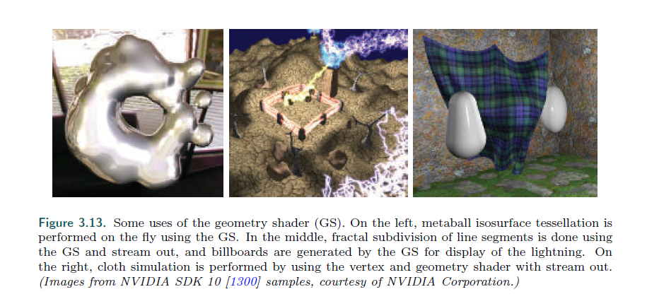

## Chapter 3.8 The Pixel Shader

>* After the vertex, tessellation, and geometry shaders perform their operations, the
primitive is clipped and set up for rasterization, as explained in the previous chapter.
This section of the pipeline is relatively fixed in its processing steps, i.e., not programmable
but somewhat configurable. Each triangle is traversed to determine which
pixels it covers. The rasterizer may also roughly calculate how much the triangle
covers each pixel’s cell area (Section 5.4.2). This piece of a triangle partially or fully
overlapping the pixel is called a fragment.
---
在 vs 曲面细分 gs 之后，基元会被裁剪并被光栅化。

这一部分的管道是相对固定的，不可编程但是可以设置。

遍历每个三角形来确定它覆盖了那些像素。

光栅器也粗略的计算了每个像素的范围内，有多少个三角形覆盖了（5.4.2）。

三角形部分或者全部覆盖一个像素的一部分（piece），称之为片元。

>* The values at the triangle’s vertices, including the z-value used in the z-buffer, are
interpolated across the triangle’s surface for each pixel. These values are passed to
the pixel shader, which then processes the fragment. In OpenGL the pixel shader is
known as the fragment shader, which is perhaps a better name. We use “pixel shader”
throughout this book for consistency. Point and line primitives sent down the pipeline
also create fragments for the pixels covered.
---
三角形顶点存储的值，包括了在z缓冲中使用的z值，会为每一个像素进行三角形内的插值。

这些值会传入 ps中，然后处理片元。

在 OpenGL 中，ps也叫fs，可能是更好的名字。

在本书中，我们用 ps。

点和线也会更具像素的覆盖来生成 片元。

>* The type of interpolation performed across the triangle is specified by the pixel
shader program. Normally we use perspective-correct interpolation, so that the worldspace
distances between pixel surface locations increase as an object recedes in the
distance. An example is rendering railroad tracks extending to the horizon. Railroad
ties are more closely spaced where the rails are farther away, as more distance is
traveled for each successive pixel approaching the horizon. Other interpolation options
are available, such as screen-space interpolation, where perspective projection is not
taken into account. DirectX 11 gives further control over when and how interpolation
is performed [530].
---
三角形内部的插值类型是 由 ps 指定的。

通常来说，我们用 透视正交插值，

请注意，几何着色器也可以什么也不生成。

通过这种方式，一个网格可以选择性的，修改顶点，增加基元，或者删除。

>* The geometry shader is designed for modifying incoming data or making a limited
number of copies. For example, one use is to generate six transformed copies of data
to simultaneously render the six faces of a cube map; see Section 10.4.3. It can also be
used to efficiently create cascaded shadow maps for high-quality shadow generation.
Other algorithms that take advantage of the geometry shader include creating variablesized
particles from point data, extruding fins along silhouettes for fur rendering, and
finding object edges for shadow algorithms. See Figure 3.13 for more examples. These
and other uses are discussed throughout the rest of the book.
---
几何着色器被设计为，对输入数据修改，或者对复制的数量进行限制（看不懂这个功能）

比如，一个用处就是生成6个 变换后的数据，来同时生成并渲染正方体的6个面 （10.4.3）。

它也能用来为高质量的阴影创建次级阴影贴图。

也有很多其他的算法，非常容易在gs上实现，比如由点数据创建变量例子，拓展边缘沿着轮廓的毛发渲染，查找阴影算法的物体边缘。

在3.13中可以看到例子。

这些和一些其他的算法会在本书的其余部分讨论。

>* Some uses of the geometry shader (GS). On the left, metaball isosurface tessellation is
performed on the fly using the GS. In the middle, fractal subdivision of line segments is done using
the GS and stream out, and billboards are generated by the GS for display of the lightning. On
the right, cloth simulation is performed by using the vertex and geometry shader with stream out.
(Images from NVIDIA SDK 10 [1300] samples, courtesy of NVIDIA Corporation.)
---
这里是 gs 的一些用途.

最左边是材质细分就是用 gs 算的。

中间是线段的细分和流输出，生成广告版和闪电的特效。

右边是布料模拟，通过vs和gs的流输出。

>* DirectX 11 added the ability for the geometry shader to use instancing, where the
geometry shader can be run a set number of times on any given primitive [530, 1971]. In
OpenGL 4.0 this is specified with an invocation count. The geometry shader can also
output up to four streams. One stream can be sent on down the rendering pipeline for
further processing. All these streams can optionally be sent to stream output render
targets.
---
DX 11 增加了为 gs 添加使用实例化的功能，这能够让 gs 对给定的任意基元执行一定的次数。

在 OpenGL 4.0 这被称为 调用记数。

gs 最多输出到4个流。

其中一个流能够被送到管线中进行下一步的处理。

所有的流都能被选择性的输出到指定的渲染目标上。

>* The geometry shader is guaranteed to output results from primitives in the same
order that they are input. This affects performance, because if several shader cores
run in parallel, results must be saved and ordered. This and other factors work against
the geometry shader being used to replicate or create a large amount of geometry in
a single call [175, 530].
---
几何着色器能保证输出结果的基元会跟他们输入的顺序一样。

这个会影响性能，因为数个着色器核心并行运行，但结果必须被保存和记数。

这些原因不利于 gs 在单次调用中 处理复制的或者创建一大堆几何体。

>* After a draw call is issued, there are only three places in the pipeline where work can
be created on the GPU: rasterization, the tessellation stage, and the geometry shader.
Of these, the geometry shader’s behavior is the least predictable when considering
resources and memory needed, since it is fully programmable. In practice the geometry
shader usually sees little use, as it does not map well to the GPU’s strengths. On
some mobile devices it is implemented in software, so its use is actively discouraged
there [69].
---
在 dc 调用后，管线中只有3个地方可以进行GPU上的创建，光栅化，曲面细分和几何着色器。

而几何着色器的行为是最不可预测的，因为它是完成可编程的，需要不同的资源和内存。

事实上，gs很少使用，因为它没有充分发挥GPU的优势。

有些手机硬件会在软件上完成gs，因此它不被推荐使用。

### 3.7.1 Stream Output

>* The standard use of the GPU’s pipeline is to send data through the vertex shader,
then rasterize the resulting triangles and process these in the pixel shader. It used to
be that the data always passed through the pipeline and intermediate results could
not be accessed. The idea of stream output was introduced in Shader Model 4.0.
After vertices are processed by the vertex shader (and, optionally, the tessellation and
geometry shaders), these can be output in a stream, i.e., an ordered array, in addition
to being sent on to the rasterization stage. Rasterization could, in fact, be turned off
entirely and the pipeline then used purely as a non-graphical stream processor. Data
processed in this way can be sent back through the pipeline, thus allowing iterative
processing. This type of operation can be useful for simulating flowing water or other
particle effects, as discussed in Section 13.8. It could also be used to skin a model and
then have these vertices available for reuse (Section 4.4).
---
标准的管线流程，数据是通过 vs，光栅化三角形，并传给 ps。

过去这个管线的流程中的中间结果是不能获取的。

但SM 4.0 提出了流输出的理念。

在 vs 处理顶点之后（可选的 曲面细分 和 gs），它除了送到光栅化阶段之外，还能输出到一个流中，比如一个有序的数组。

事实上，我们可以将光栅化关闭，然后管道就成了一个非图像的流处理器。

数据可以通过这种方式，通过流发送回来，因此能够用这个来进行迭代处理。

这种操作对模仿水流或者粒子效果非常有用 （13.8）

它通用也可以用作对模型蒙皮，让顶点进行重复使用（4.4） （应用不太懂，后续再看看）

>* Stream output returns data only in the form of floating point numbers, so it can
have a noticeable memory cost. Stream output works on primitives, not directly on
vertices. If meshes are sent down the pipeline, each triangle generates its own set
of three output vertices. Any vertex sharing in the original mesh is lost. For this
reason a more typical use is to send just the vertices through the pipeline as a point
set primitive. In OpenGL the stream output stage is called transform feedback, since
the focus of much of its use is transforming vertices and returning them for further
processing. Primitives are guaranteed to be sent to the stream output target in the
order that they were input, meaning the vertex order will be maintained [530].
---
流输出返回的数据都是浮点数，因此它的内存消耗很高。

流输出使用于基元，而不是顶点。

如果网格送入管线，每个三角形都会生成它自己的3个点集。

任何网格中的顶点共享内容将会丢失。

因此一个更典型的用法就是将管道的基元就是一个点。

在OpenGl中，流疏忽从阶段被称为变换反馈，因为它专注于转换顶点并返回他们做进一步的处理。

流输出的基元会按照输入的顺序输出，这意味着能够保持顶点的顺序。

