# Chapter 4 Transforms

参考

[Wiki正交矩阵](https://zh.wikipedia.org/wiki/%E6%AD%A3%E4%BA%A4%E7%9F%A9%E9%98%B5)

## 序

>* A transform is an operation that takes entities such as points, vectors, or colors and
converts them in some way. For the computer graphics practitioner, it is extremely
important to master transforms. With them, you can position, reshape, and animate
objects, lights, and cameras. You can also ensure that all computations are carried
out in the same coordinate system, and project objects onto a plane in different ways.
These are only a few of the operations that can be performed with transforms, but
they are sufficient to demonstrate the importance of the transform’s role in real-time
graphics, or, for that matter, in any kind of computer graphics.
---
变换是一种将元素（比如顶点，向量，颜色）进行某种形式的转换的操作。

对于计算机图形学的从业者，掌握变换是非常重要的。

通过变换，你可以调整位置，形状，动画，光照，以及摄像机。

你同样能保证所有的计算都在一个坐标系内，所有的物体都投影在一个平面上。

其实只有少量的操作会通过变换执行，但是他们非常重要。

>* A linear transform is one that preserves vector addition and scalar multiplication.
Specifically,
----
线性变换值的是向量的加法和乘法。

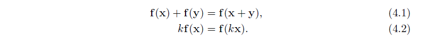

>* As an example, f (x) = 5x is a transform that takes a vector and multiplies each
element by five. To prove that this is linear, the two conditions (Equations 4.1 and 4.2)
need to be fulfilled. The first condition holds since any two vectors multiplied by five
and then added will be the same as adding the vectors and then multiplying. The
scalar multiplication condition (Equation 4.2) is clearly fulfilled. This function is
called a scaling transform, as it changes the scale (size) of an object. The rotation
transform is another linear transform that rotates a vector about the origin. Scaling
and rotation transforms, in fact all linear transforms for three-element vectors, can be
represented using a 3 × 3 matrix.
----
举个例子，f (x) = 5x 是一个将向量的每一个元素都乘上5的变换。

为了证明这是线性的，4.1和4.2中的2条式子需要被满足。

第一个条件成立，因为任意2个向量乘上5再相加和相加再乘5是一样的。

第二个条件显然成立。

这个函数被称为缩放变换，因为它改变了物体的大小。

旋转变换是另一种新型变换，它是物体绕原点的变换。

旋转和缩放变换，事实上所有对3元向量的线性变换，都能表示成3X3的矩阵。

>* However, this size of matrix is usually not large enough. A function for a threeelement
vector x such as f (x) = x+(7, 3, 2) is not linear. Performing this function on
two separate vectors will add each value of (7, 3, 2) twice to form the result. Adding
a fixed vector to another vector performs a translation, e.g., it moves all locations by
the same amount. This is a useful type of transform, and we would like to combine
various transforms, e.g., scale an object to be half as large, then move it to a different
location. Keeping functions in the simple forms used so far makes it difficult to easily
combine them.
----
然而，矩阵往往不够大。

比如一个 f (x) = x+(7, 3, 2) 就是非线性的。

对2个不同的向量进行这个操作，会对结果加上2次 (7, 3, 2)。

对任意一个向量增加一个固定的向量值，就是对所有的位置移动相同的距离。

这是一类非常有用的变换，我们通常会将它和其他的变换结合。

比如放大一个物体，并移动到一个不同的位置。

这些简单的形式能组合成非常复杂的效果。

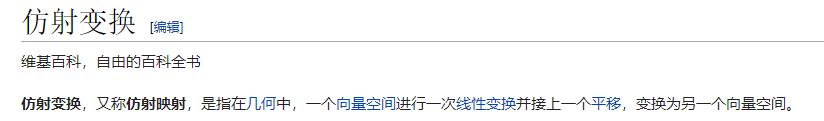

>* Combining linear transforms and translations can be done using an affine transform,
typically stored as a 4 × 4 matrix. An affine transform is one that performs
a linear transform and then a translation. To represent four-element vectors we use
homogeneous notation, denoting points and directions in the same way (using bold
lowercase letters). A direction vector is represented as v = (vx vy vz 0)T and
a point as v = (vx vy vz 1)T . Throughout the chapter, we will make extensive
use of the terminology and operations explained in the downloadable linear algebra
appendix, found on realtimerendering.com.
----
线性变换和平移的结合可以用仿射变换来表示，通常用4X4的矩阵。

一次仿射变换意味着一次线性变换，然后平移。

为了表示4元向量，我们使用齐次表示法，用同样的方法表示点和向量（使用小写粗体字母）

向量表示为  v = (vx vy vz 0)T ， 点表示为  v = (vx vy vz 1)T 。

在这一整章中，我们会对本书的线性代数附录中的内容进行广泛的使用。

>* All translation, rotation, scaling, reflection, and shearing matrices are affine. The
main characteristic of an affine matrix is that it preserves the parallelism of lines, but
not necessarily lengths and angles. An affine transform may also be any sequence of
concatenations of individual affine transforms.
----
所有的平移、旋转、缩放、反射和倾斜矩阵都是仿射的（4X4）。

仿射矩阵的主要特征是它保证了直线间的平行性（原来平行的直线依然是平行的），但不能保证长度和角度不变。

仿射矩阵也可以分解成一系列的单个仿射变换。

>* This chapter will begin with the most essential, basic affine transforms. This
section can be seen as a “reference manual” for simple transforms. More specialized
matrices are then described, followed by a discussion and description of quaternions,
a powerful transform tool. Then follows vertex blending and morphing, which are
two simple but effective ways of expressing animations of meshes. Finally, projection
matrices are described. Most of these transforms, their notations, functions, and
properties are summarized in Table 4.1, where an orthogonal matrix is one whose
inverse is the transpose.
----
这一章将会从最本质，基础的仿射变换开始。

这一节可以作为简单变换的参考手册。

之后，我们会讨论更加专业的矩阵，就是四元数，这是一个强大的变换工具。

然后是顶点的混合与形变，这是2种最简单也是最有效的网格动画的描述方式。

最后，我们会讨论投影矩阵。

大多数的矩阵，他们的符号，函数，性质在表4.1中，其中正交矩阵的逆就是它的转置。

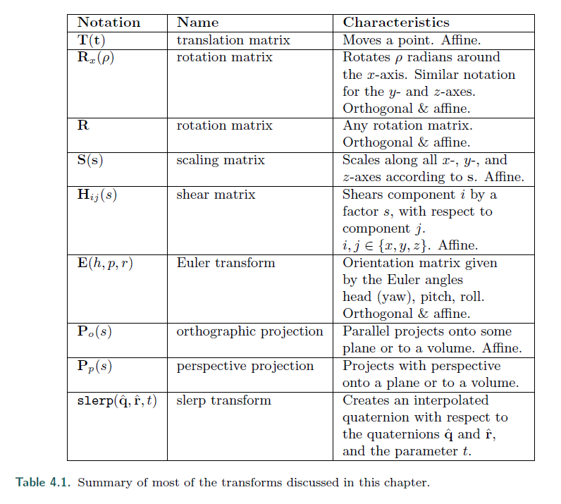

>* Transforms are a basic tool for manipulating geometry. Most graphics application
programming interfaces let the user set arbitrary matrices, and sometimes a library
may be used with matrix operations that implement many of the transforms discussed
in this chapter. However, it is still worthwhile to understand the real matrices and
their interaction behind the function calls. Knowing what the matrix does after such
a function call is a start, but understanding the properties of the matrix itself will
take you further. For example, such an understanding enables you to discern when
you are dealing with an orthogonal matrix, whose inverse is its transpose, making for
faster matrix inversions. Knowledge like this can lead to accelerated code.
----
变换是处理几何体的基础工具。

大多数的图形API都会允许设置任意的矩阵，通常会有一个实现了本章讨论的大多数矩阵操作的库。

然而，它仍然值得去弄懂真正的矩阵以及在函数调用背后的互相影响。

知道一个函数调用后这个矩阵做了什么只是一个开始，理解矩阵本身的意义能让你更进一步。

比如当你处理正交矩阵时，因为正交矩阵的转置就是它的逆，这能帮助你更快的求逆。

这些知识能够让你的代码跑得更快。

## Basic Transforms
基础变换

>* This section describes the most basic transforms, such as translation, rotation, scaling,
shearing, transform concatenation, the rigid-body transform, normal transform (which
is not so normal), and computation of inverses. For the experienced reader, this can
be used as a reference manual for simple transforms, and for the novice, it can serve
as an introduction to the subject. This material is necessary background for the rest
of this chapter and for other chapters in this book. We start with the simplest of
transforms—the translation.
----
这一章节会讲述最基础的变换，比如平移，旋转，缩放，倾斜，变换串联，刚体变换，法线变换，以及逆运算。

如果你很有经验，这一章可以作为简单变换的参考手册。

对于新手，这是对这个主题的介绍。

这一部分对本书剩余的部分是不可缺少的。

我们先从最简单的开始 -- 平移。

### 4.1.1 Translation
平移

>* A change from one location to another is represented by a translation matrix, T.
This matrix translates an entity by a vector t = (tx, ty, tz). T is given below by
Equation 4.3:
----
从一个坐标移动到另一个坐标的变换能表示成一个平移矩阵。 T。

给定移动的向量 t = (tx, ty, tz)， T 如下：

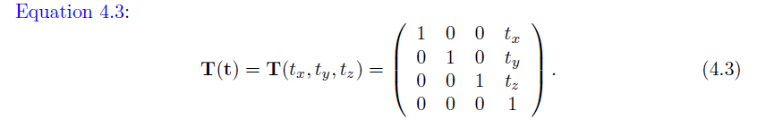

>* An example of the effect of the translation transform is shown in Figure 4.1. It is
easily shown that the multiplication of a point p = (px, py, pz, 1) with T(t) yields a
new point p′ = (px+tx, py+ty, pz+tz, 1), which is clearly a translation. Notice that a
vector v = (vx, vy, vz, 0) is left unaffected by a multiplication by T, because a direction
vector cannot be translated. In contrast, both points and vectors are affected by the
rest of the affine transforms. The inverse of a translation matrix is T−1(t) = T(−t),
that is, the vector t is negated.
----
图4.1展示了平移变换的效果。

它表示了一个点从 p = (px, py, pz, 1) 进过 T(t) 得到一个新的点 p′ = (px+tx, py+ty, pz+tz, 1)

这明显是一次平移。

注意到向量  v = (vx, vy, vz, 0) 并不受 T 的影响，因为向量不能被平移。

相比之下，点和向量都会受到仿射变换剩余的部分的影响（不算平移）。

平移矩阵的逆是 T^(−1)(t) = T(−t)，也就是说向量 t 是负的。

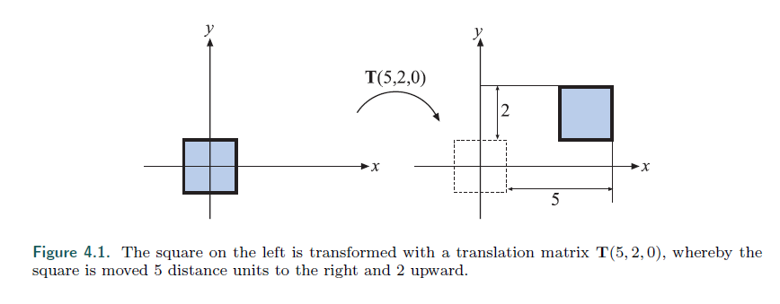

>* We should mention at this point that another valid notational scheme sometimes
seen in computer graphics uses matrices with translation vectors in the bottom row.
For example, DirectX uses this form. In this scheme, the order of matrices would
be reversed, i.e., the order of application would read from left to right. Vectors and
matrices in this notation are said to be in row-major form since the vectors are rows.
In this book, we use column-major form. Whichever is used, this is purely a notational
difference. When the matrix is stored in memory, the last four values of the sixteen
are the three translation values followed by a one.
----
我们需要提到的一点是，有时候会有另一种的表示方式，将平移的向量放在最底下的那一行中。

比如，DX就是这么做的。

在这种情况下，矩阵的顺序应该被反过来，就是矩阵的顺序应该**从左往右**。（本书的顺序是**从右往左**）

向量和矩阵在这种表示下都被称为 行主矩阵，因为向量都是行。

在这本书中，我们使用 列主形式。

不管使用哪种，都只是一个表示方式上的区别。

当矩阵被存入内存时，16个数字的最后4个值时，3个平移值，加上一个 1。

### 4.1.2 Rotation
>* A rotation transform rotates a vector (position or direction) by a given angle around
a given axis passing through the origin. Like a translation matrix, it is a rigid-body
transform, i.e., it preserves the distances between points transformed, and preserves
handedness (i.e., it never causes left and right to swap sides). These two types of
transforms are clearly useful in computer graphics for positioning and orienting objects.
An orientation matrix is a rotation matrix associated with a camera view or
object that defines its orientation in space, i.e., its directions for up and forward.
----
旋转会对一个矢量（点或者向量），进行通过原点的给定轴，进行一定角度的旋转。

跟平移矩阵一样，它是一个刚体变换，就是说，它保证了变换后的点之间的距离，以及偏手性（即，它不会导致左右交换）

这两种类型的变换是经常使用的。

方向矩阵就是摄像机空间+旋转矩阵。

>* In two dimensions, the rotation matrix is simple to derive. Assume that we have
a vector, v = (vx, vy), which we parameterize as v = (vx, vy) = (r cos θ, r sin θ). If
we were to rotate that vector by φ radians (counterclockwise), then we would get
u = (r cos(θ + φ), r sin(θ + φ)). This can be rewritten as
----
在2维空间中，旋转矩阵的推导很简单。

假设我们有一个向量 v = (vx, vy)，我们将v写作 v = (vx, vy) = (r cos θ, r sin θ)。

我们假设旋转向量  φ （逆时针方向），我们会得到 u = (r cos(θ + φ), r sin(θ + φ))。

写作：

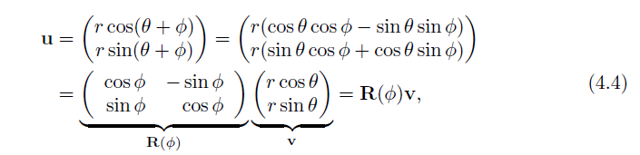

>* where we used the angle sum relation to expand cos(θ + φ) and sin(θ + φ). In three
dimensions, commonly used rotation matrices are Rx(φ), Ry(φ), and Rz(φ), which 
rotate an entity φ radians around the x-, y-, and z-axes, respectively. They are given
by Equations 4.5–4.7:
----
我们把2D的结果向3D拓展。

在3D中，常用的旋转矩阵是 Rx(φ), Ry(φ), 和 Rz(φ)

他们代表绕  x-, y-, 和 z-轴旋转，他们如下：

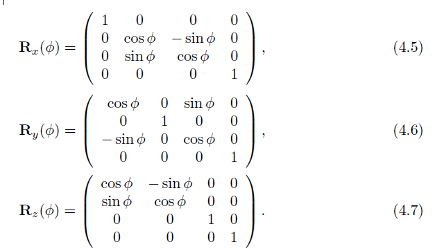

>* If the bottom row and rightmost column are deleted from a 4 × 4 matrix, a 3 × 3
matrix is obtained. For every 3×3 rotation matrix, R, that rotates φ radians around
any axis, the trace (which is the sum of the diagonal elements in a matrix) is constant
independent of the axis, and is computed as [997]:
----
如果我们删除最下面的行以及最右边的列，我们会从一个4X4的矩阵得到一个3X3的矩阵。

对于每一个 3X3 矩阵 R，绕任意轴旋转 φ 弧度

其迹 （一个矩阵中的对角线元素和）将是与坐标轴无关的常量，可以在4.8中计算：

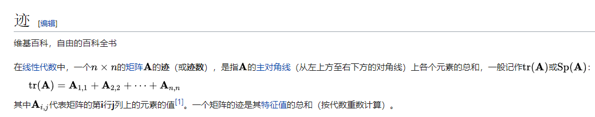

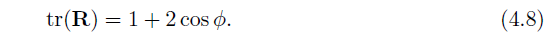

*其实就是上面3个公式4.5-4.7中的前3个对角线上值的和*

>* The effect of a rotation matrix may be seen in Figure 4.4 on page 65. What characterizes
a rotation matrix, Ri(φ), besides the fact that it rotates φ radians around
axis i, is that it leaves all points on the rotation axis, i, unchanged. Note that R will
also be used to denote a rotation matrix around any axis. The axis rotation matrices
given above can be used in a series of three transforms to perform any arbitrary axis
rotation. This procedure is discussed in Section 4.2.1. Performing a rotation around
an arbitrary axis directly is covered in Section 4.2.4.
----
旋转的效果可以在图4.4中看到。

旋转矩阵  Ri(φ)，绕着 i 轴旋转 φ 弧度，其中一个最大的特点就是在旋转轴 i 上的点是不变的。

值得注意的是 R 也可以用来表示绕任意轴的旋转。

轴旋转矩阵可以由上面3个变换组合得来。

4.2.1 中会讨论这个过程，4.2.4直接讨论任意轴的旋转。

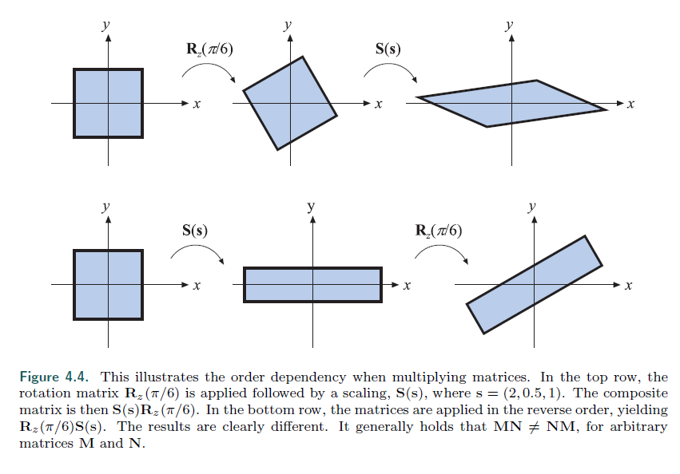

>* All rotation matrices have a determinant of one and are orthogonal. This also
holds for concatenations of any number of these transforms. There is another way to
obtain the inverse: R−1
i (φ) = Ri(−φ), i.e., rotate in the opposite direction around
the same axis.
----
所有旋转矩阵，行列式都是1，并且是正交的。

这个特性对任意旋转矩阵的串联一样适用。

还有另一种方法求旋转矩阵的逆 R^(-1) i (φ) = Ri(−φ)，即 向反方向旋转相样的角度。

>* Example: Rotation Around a Point. Assume that we want to rotate an object
by φ radians around the z-axis, with the center of rotation being a certain point,
p. What is the transform? This scenario is depicted in Figure 4.2. Since a rotation
around a point is characterized by the fact that the point itself is unaffected by the
rotation, the transform starts by translating the object so that p coincides with the
origin, which is done with T(−p). Thereafter follows the actual rotation: Rz(φ).
Finally, the object has to be translated back to its original position using T(p). The
resulting transform, X, is then given by
----
这是一个例子: 绕点旋转。

假设我们想让一个物体绕 z 轴旋转 φ 弧度，其旋转中心是确定点 P。

会是怎样的旋转呢？

图4.2展示了这个场景。

因为绕一个点的旋转的特质是，这个中心点自身不会受到旋转的影响。

所以我们先将点 P 移动到原点，就是  T(−p)。

然后做旋转 Rz(φ)。

最后平移到原来的位置，使用 T(p)。

结果写作 X ：（注意矩阵的顺序）

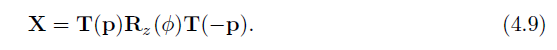

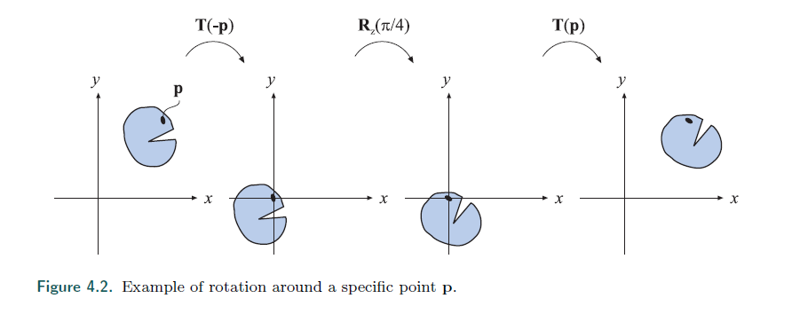

### 4.1.2 Scaling
缩放

>* A scaling matrix, S(s) = S(sx, sy, sz), scales an entity with factors sx, sy, and sz
along the x-, y-, and z-directions, respectively. This means that a scaling matrix can
be used to enlarge or diminish an object. The larger the si, i ∈ {x, y, z}, the larger the
scaled entity gets in that direction. Setting any of the components of s to 1 naturally
avoids a change in scaling in that direction. Equation 4.10 shows S:
----
一个缩放矩阵， S(s) = S(sx, sy, sz)，会对一个物体进行 x,y,z 轴三个方向分别进行 sx,sy,sz 的缩放。

这意味着，一个缩放矩阵能够用来放大或者缩小一个物体。

si i ∈ {x, y, z} 越大，这个方向的物体就越大。

如果 s 是1，就不变。

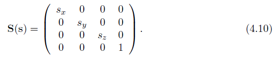

>* Figure 4.4 on page 65 illustrates the effect of a scaling matrix. The scaling operation
is called uniform if sx = sy = sz and nonuniform otherwise. Sometimes the terms
isotropic and anisotropic scaling are used instead of uniform and nonuniform. The
inverse is S−1(s) = S(1/sx, 1/sy, 1/sz).
---
4.4 中举了缩放矩阵的例子。

如果 sx = sy = sz，缩放被称为 均分缩放。

有时用 各向同性 和 各向异性 来代替是否均匀的术语。

缩放矩阵的逆是  S−1(s) = S(1/sx, 1/sy, 1/sz)。

>* Using homogeneous coordinates, another valid way to create a uniform scaling
matrix is by manipulating matrix element at position (3, 3), i.e., the element at the
lower right corner. This value affects the w-component of the homogeneous coordinate,
and so scales every coordinate of a point (not direction vectors) transformed by the
matrix. For example, to scale uniformly by a factor of 5, the elements at (0, 0), (1, 1),
and (2, 2) in the scaling matrix can be set to 5, or the element at (3, 3) can be set to
1/5. The two different matrices for performing this are shown below:
----
使用齐次坐标，另一种创建标准缩放矩阵的方法是修改 第（3,3）个元素。

就是，最右下角的元素。

这个值影响了齐次坐标的 w 分量，因此可以影响到点（不能影响向量，因为向量的w是0）的每一个坐标。

下图是2种不同的矩阵：

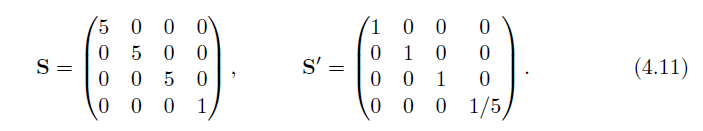

>* In contrast to using S for uniform scaling, using S′ must always be followed by homogenization.
This may be inefficient, since it involves divides in the homogenization
process; if the element at the lower right (position (3, 3)) is 1, no divides are necessary.
Of course, if the system always does this division without testing for 1, then there is
no extra cost.
----
对比于使用 S 来做标准缩放，使用 S′ 必须要进行齐次化。

这可能会更加低效，因为它涉及到了齐次化的过程。

如果右下角的元素是 1，则不需要除法。

当然，如果系统进行是否为1，并做除法检测，当然不会有其他的消耗。

>* A negative value on one or three of the components of s gives a type of reflection
matrix, also called a mirror matrix. If only two scale factors are −1, then we will rotate
π radians. It should be noted that a rotation matrix concatenated with a reflection
matrix is also a reflection matrix. Hence, the following is a reflection matrix:
----
如果s的一个值或者3个值是负值时，被称为反射矩阵，或者镜像矩阵。

如果是2个缩放因子是-1，那么我们将旋转 180 度（π 弧度）。

如果一个矩阵，串联了一个反射矩阵，那么它也是个反射矩阵。

因此，下面这个就是反射矩阵：

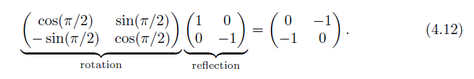

>* Reflection matrices usually require special treatment when detected. For example,
a triangle with vertices in a counterclockwise order will get a clockwise order when
transformed by a reflection matrix. This order change can cause incorrect lighting and
backface culling to occur. To detect whether a given matrix reflects in some manner,
compute the determinant of the upper left 3 × 3 elements of the matrix. If the value
is negative, the matrix is reflective. For example, the determinant of the matrix in
Equation 4.12 is 0 · 0 − (−1) · (−1) = −1.
----
反射矩阵在检测时通常需要特殊处理。

比如说，一个逆时针顺序的由3个顶点组成的三角形，经过反射，它的顶点方向就会变为顺时针。

这个顺序的改变可能会导致不正确的光照和背面剔除。

为了检测出矩阵是不是一个某种方式的反射举证，我们会计算左上角，一个3x3 的元素矩阵的行列式。

如果这个行列式是负数，那么这个矩阵是有反射性的。

比如在 4.12 中，行列式的值时 -1。

>* Example: Scaling in a Certain Direction. The scaling matrix S scales along
only the x-, y-, and z-axes. If scaling should be performed in other directions, a
compound transform is needed. Assume that scaling should be done along the axes
of the orthonormal, right-oriented vectors fx, f y, and f z. First, construct the matrix
F, to change the basis, as below:
----
例子: 在确定的方向上进行缩放。

缩放矩阵 S 只在，x，y，z轴方向上进行缩放。

如果想进行其他方向的缩放，我们需要一个复合变换。

假设旋转只沿着正交的轴进行，给定右手系向量 fx，fy，yz。

第一步，构建矩阵 F，去改变基底。

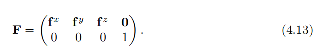

>* The idea is to make the coordinate system given by the three axes coincide with the
standard axes, then use the standard scaling matrix, and then transform back. The
first step is carried out by multiplying with the transpose, i.e., the inverse, of F. Then
the actual scaling is done, followed by a transform back. The transform is shown in
Equation 4.14:
---
我们的思路是，对于给定3个正交的标准基底，做法是先在F上做标准缩放矩阵，再乘上它的转置即可。

正交矩阵的定义，逆等于转置。

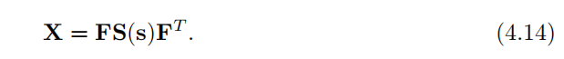

### 4.1.4 Shearing
剪切

>* Another class of transforms is the set of shearing matrices. These can, for example, be
used in games to distort an entire scene to create a psychedelic effect or otherwise warp
a model’s appearance. There are six basic shearing matrices, and they are denoted
Hxy(s), Hxz(s), Hyx(s), Hyz(s), Hzx(s), and Hzy(s). The first subscript is used
to denote which coordinate is being changed by the shear matrix, while the second
subscript indicates the coordinate which does the shearing. An example of a shear
matrix, Hxz(s), is shown in Equation 4.15. Observe that the subscript can be used to
find the position of the parameter s in the matrix below; the x (whose numeric index
is 0) identifies row zero, and the z (whose numeric index is 2) identifies column two,
and so the s is located there:
---
另一种类型的矩阵是剪切矩阵。

这个矩阵可以在游戏中扭曲整个场景来创建迷幻的效果，或者弯曲模型的表现。

有6种基础矩阵，他们是：

Hxy(s), Hxz(s), Hyx(s), Hyz(s), Hzx(s), and Hzy(s).

第一个下标表示被剪切矩阵改变的下标，第二个是进行剪切的坐标。

如图4.3

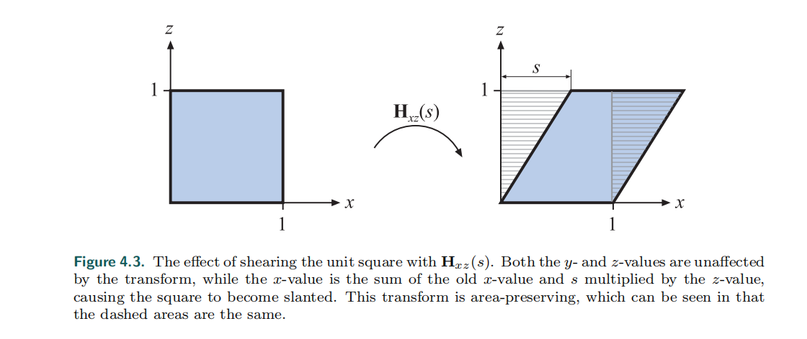
**在这里 X = X`+s * z 。其中面积不变，左右两块阴影大小一样。**

可以在公式4.15中看到，s是在矩阵中的参数，恰好对应 X = X`+s * z。

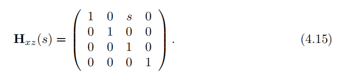

其中，可以理解为 x坐标，当z=1时，做s距离的偏移，所以，s的位置在 [0,2]

>* The effect of multiplying this matrix with a point p yields a point: (px+spz py pz)T.
Graphically, this is shown for the unit square in Figure 4.3. The inverse of Hij (s)
(shearing the ith coordinate with respect to the jth coordinate, where i != j), is
generated by shearing in the opposite direction, that is, 
Hij(-1) (s) = Hij (-s).
---
一个点P乘上这个矩阵能得到点 (px+spz py pz)T。

在图4.3中，已经有很好的描述。

Hij(s)， 对 i行的坐标加上跟 j行坐标有关的增量，i != j ，它的逆矩阵就是重新扭曲回来。

Hij(-1) (s) = Hij (-s)。

>* You can also use a slightly different kind of shear matrix:
---
你当然也可以对 shear 矩阵做一些修改。

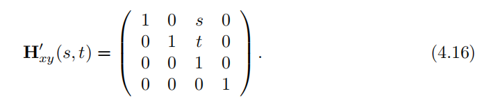

>* Here, however, both subscripts are used to denote that these coordinates are to be
sheared by the third coordinate. The connection between these two different kinds
of descriptions is H′
ij (s, t) = Hik(s)Hjk(t), where k is used as an index to the third
coordinate. The right matrix to use is a matter of taste. Finally, it should be noted
that since the determinant of any shear matrix |H| = 1, this is a volume-preserving
transformation, which also is illustrated in Figure 4.3.
---
在这里，2个下标都表示根据第三个坐标做 shear 的坐标。

他们的关系是：  H′ij (s, t) = Hik(s)Hjk(t)

k 在4.16中，就是 z，它被省略了。

只要保证矩阵的行列式 |H| = 1，保证这是一个像4.3一样，不会有面积变化（volume-preserving）的矩阵变换。

### 4.1.5 Concatenation of Transforms
矩阵的串联

>* Due to the noncommutativity of the multiplication operation on matrices, the order
in which the matrices occur matters. Concatenation of transforms is therefore said to
be order-dependent。
---
因为矩阵的乘法，不具有交换性。

所以矩阵的串联，就是他们的相乘顺序非常重要。

>* As an example of order dependency, consider two matrices, S and R. S(2, 0.5, 1)
scales the x-component by a factor two and the y-component by a factor 0.5. Rz(π/6)
rotates π/6 radians counterclockwise around the z-axis (which points outward from
page of this book in a right-handed coordinate system). These matrices can be multiplied in two ways, with the results being entirely different. The two cases are shown
in Figure 4.4.
---
这是一个串联顺序非常重要的例子

有2个矩阵，S和R，其中 S 是一个缩放矩阵 (2, 0.5, 1)

R 是一个旋转矩阵， 效果是顺时针旋转 π/6 弧度。

图4.4可以看到他们不同的相乘顺序导致了不同的结果。

>* The obvious reason to concatenate a sequence of matrices into a single one is to
gain efficiency. For example, imagine that you have a game scene that has several
million vertices, and that all objects in the scene must be scaled, rotated, and finally
translated. Now, instead of multiplying all vertices with each of the three matrices,
the three matrices are concatenated into a single matrix. This single matrix is then
applied to the vertices. This composite matrix is C = TRS. Note the order here.
The scaling matrix, S, should be applied to the vertices first, and therefore appears
to the right in the composition. This ordering implies that TRSp = (T(R(Sp))),
where p is a point to be transformed. Incidentally, TRS is the order commonly used
by scene graph systems
---
将一系列矩阵串联成一个矩阵的好处之一，就是提升效率。

比如，几个有上百万个顶点的游戏场景，这些物体都需要，缩放，旋转，唯一。

与其分别乘上3次矩阵，显然乘上一个矩阵的效率要高得多。

用这个矩阵 C = TRS。

注意这里的顺序。

旋转矩阵 S，应该第一个被对应，所以在最右边。

这个顺序意味着： TRSp = (T(R(Sp)))。

顺带一提，一般来说，TRS 是场景图系统中的常用顺序。

>* It is worth noting that while matrix concatenation is order-dependent, the matrices
can be grouped as desired. For example, say that with TRSp you would like to
compute the rigid-body motion transform TR once. It is valid to group these two
matrices together, (TR)(Sp), and replace with the intermediate result. Thus, matrix
concatenation is associative
---
值得注意的是，矩阵的级联可以根据需要进行分组。

比如 TRSp 你可以用 (TR) 表示一次刚体运动。

### 4.1.6 The Rigid-Body Transform
刚体运动矩阵变换

>* When a person grabs a solid object, say a pen from a table, and moves it to another
location, perhaps to a shirt pocket, only the object’s orientation and location change,
while the shape of the object generally is not affected. Such a transform, consisting
of concatenations of only translations and rotations, is called a rigid-body transform.
It has the characteristic of preserving lengths, angles, and handedness.
---
当一个人抓住了一个固体的物体，比如桌子上的一只笔

把它移动到了另一个位置，比如口袋里。

仅有位置和方向的变化，物体的外表形状没有变。

这样一个，只包含了移动和旋转的矩阵变换，称为刚体变换。

刚体变换具有，保留长度，角度，手性的特点。

>* Any rigid-body matrix, X, can be written as the concatenation of a translation
matrix, T(t), and a rotation matrix, R. Thus, X has the appearance of the matrix in
Equation 4.17:
---
任何刚体矩阵 X，可以写成一系列移动矩阵 T 和旋转矩阵 R 的级联。

因此，X可以写成 4.17：

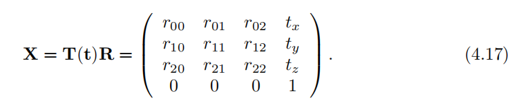

>* The inverse of X is computed as X(-1) = (T(t)R) (-1) = R(-1) T(t)(-1) = R(T)T(-t)
Thus, to compute the inverse, the upper left 3 × 3 matrix of R is transposed, and the
translation values of T change sign. These two new matrices are multiplied together
in opposite order to obtain the inverse. Another way to compute the inverse of X is
to consider R (making R appear as 3 × 3 matrix) and X in the following notation
(notation described on page 6 with Equation 1.2):
---
X 的逆矩阵是 R(T转置)T(-t) 。

即旋转矩阵，取它的转置， 位移矩阵，取负数。

这2个矩阵相乘就能得到对应的原来 X 的逆。

另一种计算 X 的逆的方法是，假定一个矩阵 R 是一个3x3的旋转元素构成的矩阵

则 X 可以写成：

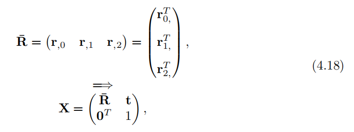

>* where r,0 means the first column of the rotation matrix (i.e., the comma indicates any
value from 0 to 2, while the second subscript is 0) and rT0,
is the first row of the column matrix.
Note that **0** is a 3×1 column vector filled with zeros.
Some calculations yield the inverse in the expression shown in Equation 4.19:
---
r,0 表示旋转矩阵的第一列 （逗号表示从0到2， 第二个下标是0）

rT0，表示矩阵的第一行，加粗的 0，表示的是一个 3x1 的列向量。

化简后，X 的逆如下表示：

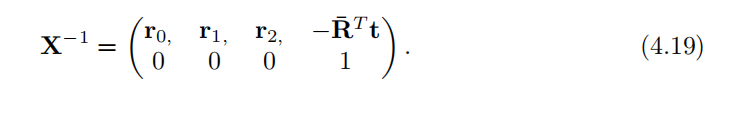

>* Example: Orienting the Camera.
下面是一个旋转相机的例子
---
>* A common task in graphics is to orient the
camera so that it looks at a certain position. Here we will present what gluLookAt()
(from the OpenGL Utility Library, GLU for short) does. Even though this function
call itself is not used much nowadays, the task remains common. Assume that the
camera is located at c, that we want the camera to look at a target l, and that a given
up direction of the camera is u′, as illustrated in Figure 4.5.
---
一个很常见的情形就是，旋转一个相机，让它看向某个确定的点。

我们会展示，gluLookAt() 一个OpenGL的接口，做了什么。

尽管这个函数如今不是经常使用了，但旋转一个相机的需求还是很多。

假设我们的相机的位置在 c，我们想让相机看向目标 l，给定相机的 up 向量是 u`，如图 4.5。

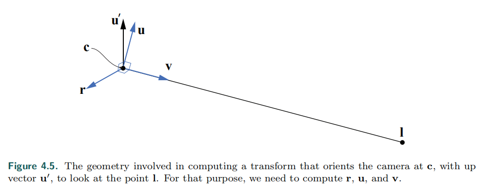

>* We want to compute a basis consisting of three vectors, {r, u, v}.
We start by computing the view vector as v = (c-l)/||c-l||, 
i.e., the normalized vector from the target to the camera position.
A vector looking to the “right” can then be computed as r = - (v × u′)/||v × u′||.
The u′ vector is often not guaranteed to be pointing precisely up, so the final up
vector is another cross product, u = v × r, which is guaranteed to be normalized
since both v and r are normalized and perpendicular by construction. In the camera
transform matrix, M, that we will construct, the idea is to first translate everything
so the camera position is at the origin, (0, 0, 0), and then change the basis so that r is
aligned with (1, 0, 0), u with (0, 1, 0), and v with (0, 0, 1). This is done by
---
我们需要计算一组基向量 {r, u, v}

首先是 v 的计算，  v = (c-l)/||c-l||

这就是从相机位置c指向l的单位向量。

右向量可以通过叉乘计算出来（这里多了一个负号，这里是左手系）

r = - (v × u′)/||v × u′||

u`向量经常不能保证精准的指向上方。

所以需要用一次叉乘来校正。

 u = v × r

在摄像机变换的矩阵中，我们先把照相机的位置移动到原点。

再改变基底，使得r,u,v 分别为标准的正交基底

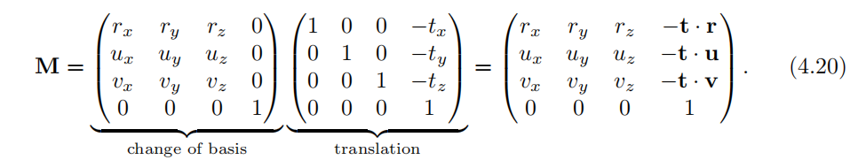

>* Note that when concatenating the translation matrix with the change of basis matrix,
the translation -t is to the right since it should be applied first. One way to remember
where to put the components of r, u, and v is the following. We want r to become
(1, 0, 0), so when multiplying a change of basis matrix with (1, 0, 0), we can see that
the first row in the matrix must be the elements of r, since r · r = 1. Furthermore, the
second row and the third row must consist of vectors that are perpendicular to r, i.e.,
r · x = 0. When applying the same thinking also to u and v, we arrive at the change
of basis matrix above. 
---
注意到，当将位移矩阵和变幻基底矩阵连接时，

矩阵 -t 要放在右边。

我们可以这样记忆，我们想要将 r 转变为 (1, 0, 0)

我们通过 (1, 0, 0) 乘上基转换矩阵 就也能得到 r, 因为 r · r = 1

而我们用基变幻矩阵得到的内容，一定与 r 垂直，即 r · x = 0. (这一段没看太懂)

于是，我们能得到 4.20 的公式。

### 4.1.7 Normal Transform
正交变幻

>* A single matrix can be used to consistently transform points, lines, triangles, and
other geometry. The same matrix can also transform tangent vectors following along
these lines or on the surfaces of triangles. However, this matrix cannot always be used
to transform one important geometric property, the surface normal (and the vertex
lighting normal). Figure 4.6 shows what can happen if this same matrix is used.
---
单个矩阵，可以用于改变 点，线，三角形 和其他几何体。

能够通过线或者表面的三角形来改变切向量。

然而，这种矩阵不能用于转换重要的几何体属性，表面法线（或者是顶点的光照法线。）

4.6说明了这种情况。

（即，矩阵变换，导致法线不再垂直于面）

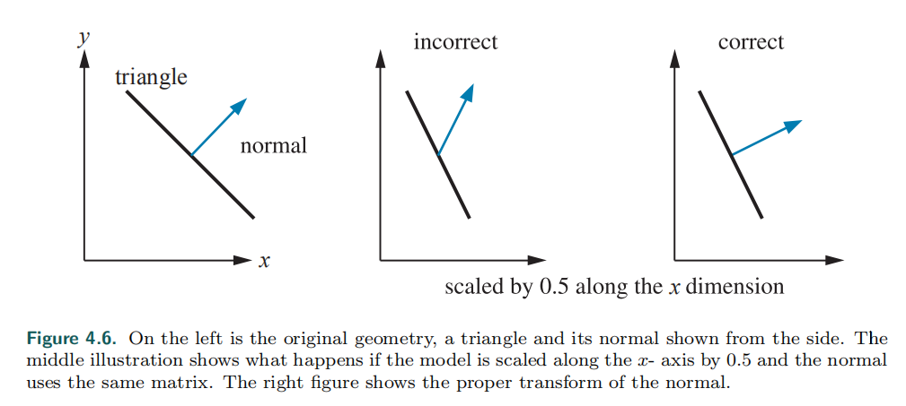

最左边的是一个三角形和它的法线。

坐标是将x轴的坐标变为原来的 0.5 （缩放矩阵) 法线也做同样的处理

最右边是正确的情况。

>* Instead of multiplying by the matrix itself, 
the proper method is to use the transpose of the matrix’s adjoint [227]. 
Computation of the adjoint is described in our
online linear algebra appendix. The adjoint is always guaranteed to exist. 
The normal is not guaranteed to be of unit length after being transformed, 
so typically needs to be normalized.
---
相比乘上相同的矩阵，正确的做法是使用矩阵的 伴随矩阵。

伴随矩阵的算法在附录中有。

伴随矩阵常常都是存在的。

经过伴随矩阵变换的内容，长度是不能保证的。所以需要进行正交化。

>* The traditional answer for transforming the normal is that the transpose of the
inverse is computed [1794]. This method normally works. The full inverse is not
necessary, however, and occasionally cannot be created. The inverse is the adjoint
divided by the original matrix’s determinant. If this determinant is zero, the matrix
is singular, and the inverse does not exist.
---
一般来说，求法线对应的矩阵变换，是计算这个矩阵的逆。

这通常可行。

但逆不一定存在，逆矩阵是 伴随矩阵除以原矩阵的 det(秩) 得到的

如果一个矩阵的秩为0，那么就是奇异矩阵，就不存在逆矩阵。

>* Even computing just the adjoint for a full 4 × 4 matrix can be expensive, 
and is usually not necessary. 
Since the normal is a vector, 
translation will not affect it. 
Furthermore, most modeling transforms are affine. 
They do not change the w-component of the homogeneous coordinate passed in, 
i.e., they do not perform projection. Under these (common) circumstances, 
all that is needed for normal transformation is to
compute the adjoint of the upper left 3 × 3 components.
---
即使是计算一个 4乘4 的伴随矩阵，代价是很高的。

而且我们也没有必要全部算出来。

因为法线是一条向量，所以移动变换（单纯移动位置）是不会对法线造成影响的。

进一步说，大多数的模型变换是仿射变换（缩放 + 平移）。

他们不会改变传入的齐次坐标中的 w 分量。

即，他们不会做投影映射。在这些一般的情况下，

法线变换需要做的，就是计算左上角 3乘3 的伴随矩阵。

>* Often even this adjoint computation is not needed. Say we know the transform
matrix is composed entirely of a concatenation of translations, rotations, and uniform
scaling operations (no stretching or squashing). Translations do not affect the normal.
The uniform scaling factors simply change the length of the normal. What is left is
a series of rotations, which always yields a net rotation of some sort, nothing more.
---
甚至这一次伴随矩阵的变换也不需要算了。

因为我们知道，矩阵可以由一系列的 平移，旋转，缩放组成（没有拉伸和压缩）。

平移不影响法线，缩放只改变法线的长度。

剩下的就是一系列的旋转矩阵。

>* The transpose of the inverse can be used to transform normals. A rotation matrix is
defined by the fact that its transpose is its inverse. Substituting to get the normal
transform, two transposes (or two inverses) give the original rotation matrix. Putting
it all together, the original transform itself can also be used directly to transform
normals under these circumstances.
---

