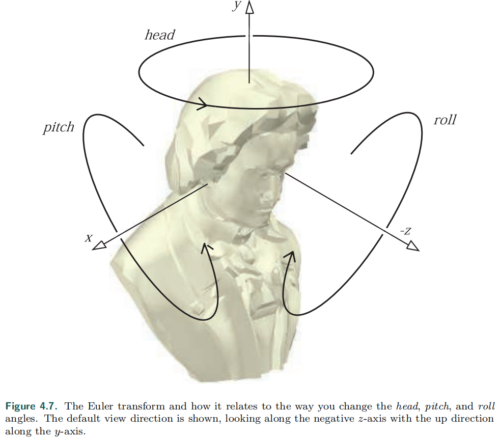
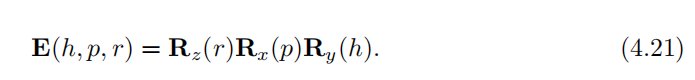

# Chapter 4.2 Special Matrix Transforms and Operations

>* In this section, several matrix transforms and operations that are essential to real-time
graphics will be introduced and derived. First, we present the Euler transform (along
with its extraction of parameters), which is an intuitive way to describe orientations.
Then we touch upon retrieving a set of basic transforms from a single matrix. Finally,
a method is derived that rotates an entity around an arbitrary axis.
---
在这一节中，几个对于实时渲染十分重要的矩阵变换和操作，将会被介绍和推导。

首先我们介绍欧拉变换（以及它的参数提取），这是一种描述方向的直观的方法。

然后我们可以接触到，如何将一个矩阵，还原成一组基变换。

最后，是一种绕任意轴旋转角度的方法。

# 4.2.1 The Euler Transform
欧拉变换

[知乎相关](https://zhuanlan.zhihu.com/p/45404840)

>* This transform is an intuitive way to construct a matrix to orient yourself (i.e., the
camera) or any other entity in a certain direction. Its name comes from the great
Swiss mathematician Leonhard Euler
---
这是一个直观的方法，去构造一个矩阵旋转自身（比如，照相机）

或者在确定的方向上旋转其他物体。

它的名字来自于伟大的数学家 欧拉

>* First, some kind of default view direction must be established. Most often it
lies along the negative z-axis with the head oriented along the y-axis, as depicted in
Figure 4.7. The Euler transform is the multiplication of three matrices, namely the
rotations shown in the figure. More formally, the transform, denoted E, is given by
Equation 4.21:
---
第一步，要建立一些默认的初始方向。

例如 4.7.

欧拉变换是由3个矩阵相乘得到的，如公式 4.21

>* The order of the matrices can be chosen in 24 different ways [1636]; we present this one
because it is commonly used. Since E is a concatenation of rotations, it is also clearly
orthogonal. Therefore its inverse can be expressed as E^ -1 = E^T = (RzRxRy)^T = （Ry)^T （Rx)^T （Rz)^T
, although it is, of course, easier to use the transpose of E directly.
---
矩阵的顺序有24种不同的方法。

我们使用的这种方式是最经常使用的。

因为E是旋转的级联，所以它也是正交矩阵，因此有：

E^ -1 = E^T = (RzRxRy)^T = （Ry)^T （Rx)^T （Rz)^T

当然，我们直接使用 E 的转置就更容易了。

>* The Euler angles h, p, and r represent in which order and how much the head,
pitch, and roll should rotate around their respective axes. Sometimes the angles are
all called “rolls,” e.g., our “head” is the “y-roll” and our “pitch” is the “x-roll.” Also,
“head” is sometimes known as “yaw,” such as in flight simulation.
---
欧拉角用 h,p,r 代表了 head，pitch，roll三条轴的旋转度。

>* This transform is intuitive and therefore easy to discuss in layperson’s language.
For example, changing the head angle makes the viewer shake their head “no,” 
changing the pitch makes them nod, and rolling makes them tilt their head sideways. Rather
than talking about rotations around the x-, y-, and z-axes, we talk about altering the
head, pitch, and roll. Note that this transform can orient not only the camera, but
also any object or entity as well. These transforms can be performed using the global
axes of the world space or relative to a local frame of reference.
---
这种矩阵变换非常直观，也很容易描述。

比如，改变 head 角度，会让照相机晃动，跟人摇头一样。 

改变 pitch 类似于点头

roll 使得歪头看向一边。

与其说绕 x ，y，z 轴旋转，不如直接用 head, pitch, roll.

注意到，这种变换不仅仅可以用于描述摄像机的朝向，也能描述物体的旋转方向。

这个旋转变换，可以通过全局的坐标轴做变换，或者使用局部的坐标轴。

>* It is important to note that some presentations of Euler angles give the z-axis
as the initial up direction. This difference is purely a notational change, though a
potentially confusing one. In computer graphics there is a division in how the world is
regarded and thus how content is formed: y-up or z-up. Most manufacturing processes,
including 3D printing, consider the z-direction to be up in world space; aviation and
sea vehicles consider ∇z to be up. Architecture and GIS normally use z-up, as a
building plan or map is two-dimensional, x and y. Media-related modeling systems
often consider the y-direction as up in world coordinates, matching how we always
describe a camera’s screen up direction in computer graphics.
---
值得注意的是，有些欧拉角的表示，直接给定Z轴为默认的向上的方向。

这会带来符号的混乱。

在计算机图形学中，有两种世界坐标分类，y-up 和 z-up

在大多数实际应用中情况下（比如3D打印，航空等），都是以 z-up 为主的。

在和建模相关的软件中，一般来说都是 y-up，这样与我们经常在计算机图形学中描述的相机坐标系，是一致的。

>* The difference between these two world up vector choices is just a 90◦
rotation (and possibly a reflection)
away, but not knowing which is assumed can lead to problems. In this volume we use
a world direction of y-up unless otherwise noted.
---
这2个向量的选择(y-up / z-up)其实就是相差了90度。

但在本书中，我们都用  y-up

>* We also want to point out that the camera’s up direction in its view space has
nothing in particular to do with the world’s up direction. Roll your head and the
view is tilted, with its world-space up direction differing from the world’s. As another
example, say the world uses y-up and our camera looks straight down at the terrain
below, a bird’s eye view. This orientation means the camera has pitched 90◦
forward,
so that its up direction in world space is (0, 0, -1). In this orientation the camera
has no y-component and instead considers sz to be up in world space, but “y is up”
remains true in view space, by definition.
---
注意到的一点是，摄像机的坐标轴（up向量），跟世界的up向量一点关系都没有。

你转动你的头，你的视野是倾斜的，因为你的头的up向量已经跟世界的不一样了。

再举个例子，鸟瞰图，这个朝向意味着视线是90度向下的，这时候你的头的up向量是 (0, 0, -1)

在这里，没有  xyz 中的 y 元素，但是 y 是up向量是没错的

因为在 y-up 坐标里面，是这么定义的。

>* While useful for small angle changes or viewer orientation, Euler angles have some
other serious limitations. It is difficult to work with two sets of Euler angles in combi

